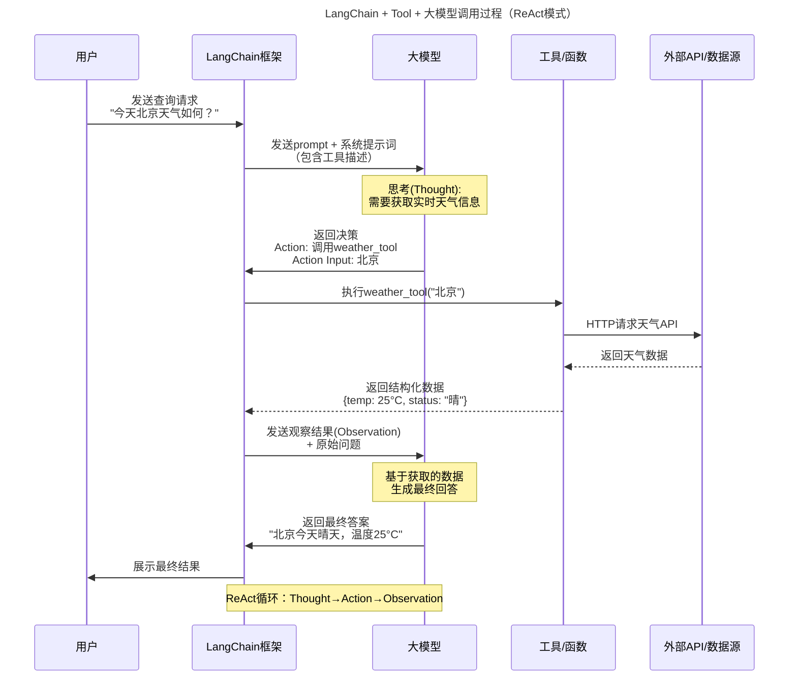
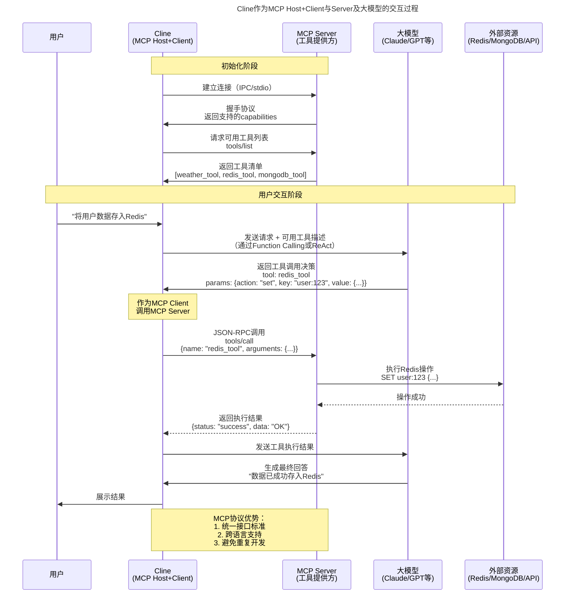
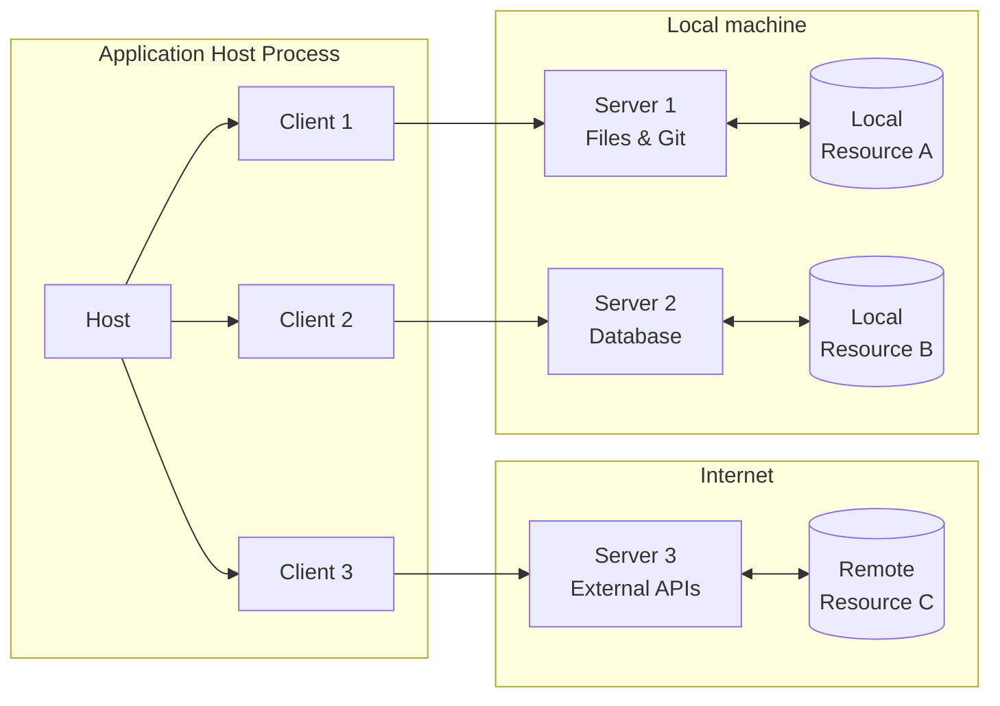
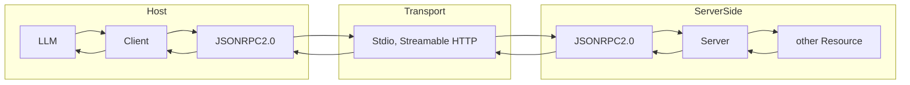
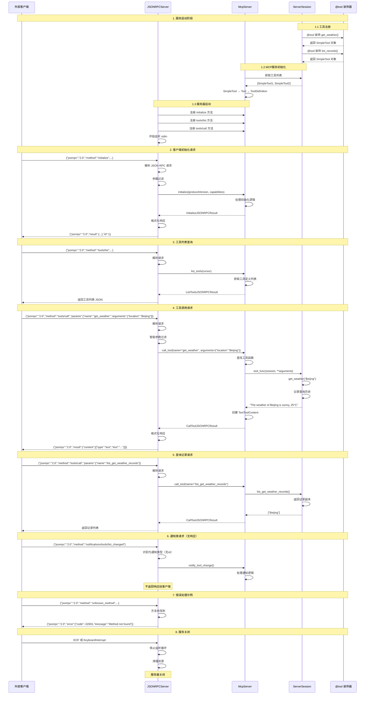
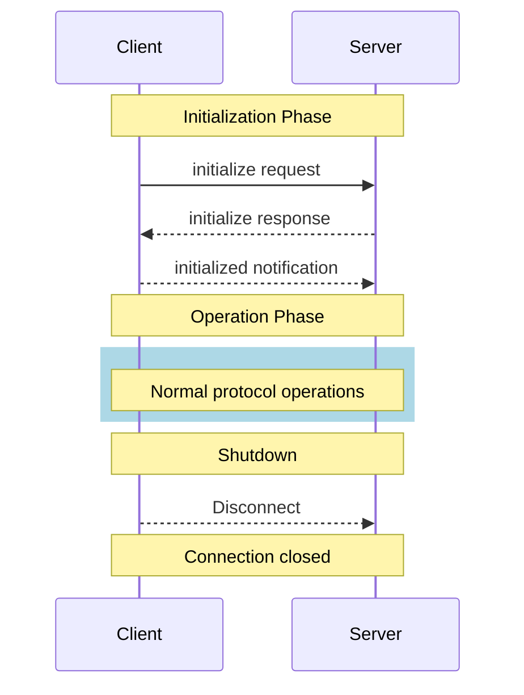
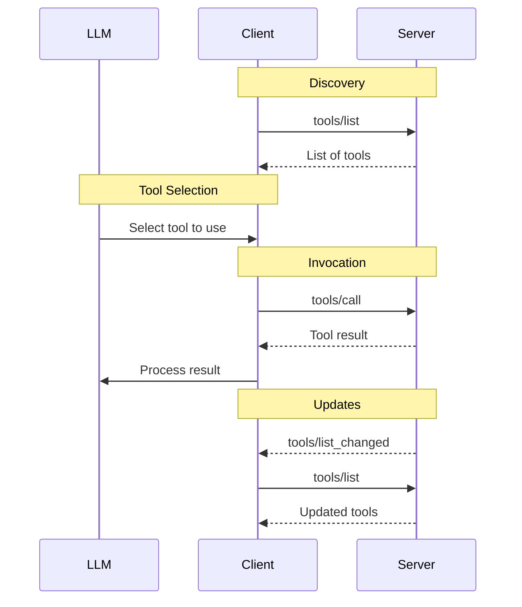

# LLM

简单介绍一下 LLM（Large Language Model），就是你输入一段文字，机器猜你下一个词是什么，就这么简单。

详细了解，看我上一篇文章（TODO 放链接），大模型并没有“记住”你的事情，看下面演示。

不管是 RAG、Agent、MultiAgent、ReAct、Prompt Engineering、Context Engineering 等等，它们做的事情都是一样的，“掩盖” LLM 的不足。就是有上下文窗口限制，并且输入只能图片、文字，输出只能是文字。
管你吹得什么天花乱坠，它们之间的本质，就是想办法把获取到的信息（文字、图片）传入到 LLM 中，然后进行推理，输出文字，这个文字可以是结构化的文字，也可以就单纯是个文本。

我举个简单的例子。我想让大模型返回结构化的内容，按照我的提示词来返回，我需要写类似下面一段提示词:

```plaintext
你是D-Cline，是一个优秀的Agent，你精通软件工程，精通各种编程语言、框架、设计模式以及代码的最佳实践。

===
你有一系列的工具可以使用，你每个消息可以使用一个工具，并且会接收到用户响应调用工具的结果，在调用工具前，你必须 thinking step by step。

# 工具使用格式

工具调用使用 XML 格式，XML 格式必须和下面一致。

<tool_name>
<parameter1_name>value1</parameter1_name>
<parameter2_name>value2</parameter2_name>
...
</tool_name>

样例1：
<read_file>
<path>src/main.js</path>
<task_progress>Checklist here (optional)</task_progress>
</read_file>

# Tools
你将有以下工具可以调用

## read_file
描述：读取文件内容
参数：
- path：文件路径
- task_progress：任务进度（可选）
使用：

<read_file>
<path>文件路径</path>
<task_progress>任务进度（可选）</task_progress>
</read_file>

## append_file
描述：追加文件内容
参数：
- path：文件路径
- content：文件内容
使用：

<append_file>
<path>文件路径</path>
<content>文件内容</content>
</append_file>

## delete_file
描述：删除文件
参数：
- path：文件路径
使用：

<delete_file>
<path>文件路径</path>
</delete_file>

# 使用 MCP tool
描述：请求使用由连接的 MCP 服务器提供的工具。每个 MCP 服务器可以提供多个具有不同功能的工具。工具具有定义的输入模式，用于指定必需和可选参数。
参数：
- server_name: (必需) 提供工具的 MCP 服务器名称
- tool_name: (必需) 要执行的工具名称
- arguments: (必需) 包含工具输入参数的 JSON 对象，遵循工具的输入模式
用法：

<use_mcp_tool>
<server_name>server name here</server_name>
<tool_name>tool name here</tool_name>
<arguments>
{
  "param1": "value1",
  "param2": "value2"
}
</arguments>
</use_mcp_tool>

使用 MCP Tool 样例1：
<use_mcp_tool>
<server_name>weather-server</server_name>
<tool_name>get_forecast</tool_name>
<arguments>
{
  "city": "San Francisco",
  "days": 5
}
</arguments>
</use_mcp_tool>


使用 MCP Tool 样例2：
<use_mcp_tool>
<server_name>github.com/modelcontextprotocol/servers/tree/main/src/github</server_name>
<tool_name>create_issue</tool_name>
<arguments>
{
  "owner": "octocat",
  "repo": "hello-world",
  "title": "Found a bug",
  "body": "I'm having a problem with this.",
  "labels": ["bug", "help wanted"],
  "assignees": ["octocat"]
}
</arguments>
</use_mcp_tool>
===
# MCP Server
现在你有这些 MCP Server 可以调用：

## fake-weather-server
### 可用工具如下
- get_weather：根据输入的城市名称，返回该城市的天气信息
  输入参数：
    - city：城市名称
  输出：
    - weather：天气信息
    - temperature：温度
    - humidity：湿度
    - wind：风速

- list_get_weather_records：返回查询过的所有的天气记录
  输入参数：无
  输出：
    - weather_records：天气记录
      - city：城市名称
      - weather：天气信息
      - temperature：温度
      - humidity：湿度
      - wind：风速
```

{
    "content": "我想查看杭州的天气",
    "role": "user"
}

输出
```json
{
  "id": "241a56e7-3631-4566-a3e5-261c8e21a369",
  "object": "chat.completion",
  "created": 1757945376,
  "model": "deepseek-chat",
  "choices": [
    {
      "index": 0,
      "message": {
        "role": "assistant",
        "content": "<use_mcp_tool>\n<server_name>fake-weather-server</server_name>\n<tool_name>get_weather</tool_name>\n<arguments>\n{\n  \"city\": \"杭州\"\n}\n</arguments>\n</use_mcp_tool>"
      },
      "logprobs": null,
      "finish_reason": "stop"
    }
  ],
  "usage": {
    "prompt_tokens": 823,
    "completion_tokens": 52,
    "total_tokens": 875,
    "prompt_tokens_details": {
      "cached_tokens": 768
    },
    "prompt_cache_hit_tokens": 768,
    "prompt_cache_miss_tokens": 55
  },
  "system_fingerprint": "fp_08f168e49b_prod0820_fp8_kvcache"
}
```
可以看到，实际上，是取这个 content 里面的内容，那些所谓兼容所有 LLM 的客户端，都是这么写的。还有一种就是将 tool 转成 Function Calling 的方法，有些大模型可能不支持。

```xml
<use_mcp_tool>
	<server_name>fake-weather-server</server_name>
	<tool_name>get_weather</tool_name>
	<arguments>{"city":"杭州"}</arguments>
</use_mcp_tool>
```
这里做一些非常简单的调用

## 单一调用
请求

```http

POST https://api.deepseek.com/chat/completions HTTP/1.1

Content-Type: application/json

Accept: application/json

Authorization: Bearer {{$dotenv DEEPSEEK_API_KEY}}


{

  "messages": [

    {

      "content": "You are an intelligent customer service agent named Alice. Your main role is to help users answer their questions.",

      "role": "system"

    },

    {

      "content": "Hello, who are you?",

      "role": "user"

    }

  ],

  "model": "deepseek-chat",

  "stream": false,

  "temperature": 0

}

```


response body

```json

{

  "id": "e479b679-84d4-48c1-bf6f-ad7f56c87682",

  "object": "chat.completion",

  "created": 1756429739,

  "model": "deepseek-chat",

  "choices": [

    {

      "index": 0,

      "message": {

        "role": "assistant",

        "content": "Hello! I'm Alice, your intelligent customer service agent. How can I assist you today?"

      },

      "logprobs": null,

      "finish_reason": "stop"

    }

  ],

  "usage": {

    "prompt_tokens": 31,

    "completion_tokens": 19,

    "total_tokens": 50,

    "prompt_tokens_details": {

      "cached_tokens": 0

    },

    "prompt_cache_hit_tokens": 0,

    "prompt_cache_miss_tokens": 31

  },

  "system_fingerprint": "fp_feb633d1f5_prod0820_fp8_kvcache"

}

```


## 多轮对话


```http

POST https://api.deepseek.com/chat/completions HTTP/1.1

Content-Type: application/json

Accept: application/json

Authorization: Bearer {{$dotenv DEEPSEEK_API_KEY}}


{

  "messages": [

    {

      "content": "You are an intelligent customer service agent named Alice. Your main role is to help users answer their questions. The company's main business is quantitative trading.",

      "role": "system"

    },

    {

      "content": "Hello, who are you?",

      "role": "user"

    },

    {

      "content": "Hello! I'm Alice, your intelligent customer service agent. How can I assist you today?",

      "role": "assistant"

    },

    {

      "content": "I would like to inquire about your company's business.",

      "role": "user"

    }

  ],

  "model": "deepseek-chat",

  "stream": false,

  "temperature": 0

}

```

response body

```json

{

  "id": "f21a4cd8-baad-449c-a91a-8ac38a674715",

  "object": "chat.completion",

  "created": 1756429876,

  "model": "deepseek-chat",

  "choices": [

    {

      "index": 0,

      "message": {

        "role": "assistant",

        "content": "Of course! Our company specializes in quantitative trading, which involves using mathematical models, algorithms, and data analysis to make trading decisions in financial markets. We leverage technology and data to identify patterns, manage risk, and execute trades efficiently. \n\nIs there a specific aspect of quantitative trading you'd like to learn more about?"

      },

      "logprobs": null,

      "finish_reason": "stop"

    }

  ],

  "usage": {

    "prompt_tokens": 74,

    "completion_tokens": 63,

    "total_tokens": 137,

    "prompt_tokens_details": {

      "cached_tokens": 0

    },

    "prompt_cache_hit_tokens": 0,

    "prompt_cache_miss_tokens": 74

  },

  "system_fingerprint": "fp_feb633d1f5_prod0820_fp8_kvcache"

}

```


## 使用 Function Calling


请求

```http

POST https://api.deepseek.com/chat/completions HTTP/1.1

Content-Type: application/json

Accept: application/json

Authorization: Bearer {{$dotenv DEEPSEEK_API_KEY}}


{

  "messages": [

    {

      "content": "你是一个智能客服 Alice，你的主要作用就是帮用户解答疑问",

      "role": "system"

    },

    {

      "content": "你好，查一下北京的天气",

      "role": "user"

    }

  ],

  "model": "deepseek-chat",

  "tools": [

    {

      "type": "function",

        "function": {

            "name": "get_weather",

            "description": "Get weather of a location, the user should supply a location first.",

            "parameters": {

                "type": "object",

                "properties": {

                    "location": {

                        "type": "string",

                        "description": "The city and state, e.g. San Francisco, CA"

                    }

                },

                "required": ["location"]

            }

        }

    }

  ],

  "stream": false,

  "temperature": 0

}

```


response body

```json

{

  "id": "2e85bf30-d509-4ee6-bc18-b65d1b8e02df",

  "object": "chat.completion",

  "created": 1756430135,

  "model": "deepseek-chat",

  "choices": [

    {

      "index": 0,

      "message": {

        "role": "assistant",

        "content": "I'll check the weather in Hangzhou for you right away.",

        "tool_calls": [

          {

            "index": 0,

            "id": "call_0_c9f112b0-766e-48ee-8b7d-a70c14f16b43",

            "type": "function",

            "function": {

              "name": "get_weather",

              "arguments": "{\"location\": \"hangzhou\"}"

            }

          }

        ]

      },

      "logprobs": null,

      "finish_reason": "tool_calls"

    }

  ],

  "usage": {

    "prompt_tokens": 212,

    "completion_tokens": 28,

    "total_tokens": 240,

    "prompt_tokens_details": {

      "cached_tokens": 192

    },

    "prompt_cache_hit_tokens": 192,

    "prompt_cache_miss_tokens": 20

  },

  "system_fingerprint": "fp_feb633d1f5_prod0820_fp8_kvcache"

}

```


### Function Calling conversation


request


```http

POST https://api.deepseek.com/chat/completions HTTP/1.1

Content-Type: application/json

Accept: application/json

Authorization: Bearer {{$dotenv DEEPSEEK_API_KEY}}


{

  "messages": [

    {

      "role": "system",

      "content": "You are an intelligent customer service agent named Alice. Your main role is to help users answer their questions."

    },

    {

      "role": "user",

      "content": "Hello, please check the weather in Beijing."

    },

    {

      "role": "assistant",

      "content": "I'll check the weather in Hangzhou for you right away.",

      "tool_calls": [

        {

          "index": 0,

          "id": "call_0_c9f112b0-766e-48ee-8b7d-a70c14f16b43",

          "type": "function",

          "function": {

            "name": "get_weather",

            "arguments": "{\"location\": \"hangzhou\"}"

          }

        }

      ]

    },

    {

      "role": "tool",

      "tool_call_id": "call_0_c9f112b0-766e-48ee-8b7d-a70c14f16b43",

      "content": "Sunny, 29°C"

    }

  ],

  "model": "deepseek-chat",

  "tools": [

    {

      "type": "function",

      "function": {

        "name": "get_weather",

        "description": "Get weather information for a location.",

        "parameters": {

          "type": "object",

          "properties": {

            "location": {

              "type": "string",

              "description": "The name of the city to get weather for. Only support low case location name, like beijing, shanghai, hangzhou, newyork"

            }

          },

          "required": [

            "location"

          ]

        }

      }

    }

  ],

  "stream": false,

  "temperature": 0

}

```


response body


```json

{

  "id": "2ef2e44e-8540-4798-8530-77b63209e1a9",

  "object": "chat.completion",

  "created": 1756430434,

  "model": "deepseek-chat",

  "choices": [

    {

      "index": 0,

      "message": {

        "role": "assistant",

        "content": "The weather in Hangzhou is currently sunny with a temperature of 29°C. It's a beautiful day there! Is there anything else you'd like to know about the weather or any other assistance I can provide?"

      },

      "logprobs": null,

      "finish_reason": "stop"

    }

  ],

  "usage": {

    "prompt_tokens": 238,

    "completion_tokens": 44,

    "total_tokens": 282,

    "prompt_tokens_details": {

      "cached_tokens": 0

    },

    "prompt_cache_hit_tokens": 0,

    "prompt_cache_miss_tokens": 238

  },

  "system_fingerprint": "fp_feb633d1f5_prod0820_fp8_kvcache"

}

```


这就是大模型，就是猜你下一段词是什么，就这么简单。


# 背景介绍


一开始 OpenAI 的 GPT 接口出来的时候，并没有提供 Function Calling 这样的功能，但是为了和现实世界进行交互，LangChain, Smolagents 这种框架，又想要和

现实世界进行交互，并获得相应的信息，它就只能在返回的文本上，自定义格式，通过装饰器 @tool（Java 里可以用注解）解析成一个 Tool 对象，这个对象有入参，及其参数描述，

有这个方法的描述。在调用大模型的时候，只需要 Tool 解析成 System prompt 文本，并且以特定的格式返回，进行是否调用工具，然后执行下一步。这里我们暂且按下不表，

后面会介绍 Cline 是如何实现的，详细解释通过控制 system prompt 来实现结构化返回，并且解析结构化返回内容实现“智能”调用工具。


这样说有点抽象，写一个例子，这里我是用 uv 来管理包。我并不推荐使用 LangChain 用于生产环境，变更太多了，本来就是一件简单的事情，越搞越复杂，已经过于臃肿了，

LangChain Community，文档也更新不及时，对新人来说很不友好，什么 LangSmith，LangGraph 干什么呢。


## ReAct + @Tool


prepare install uv, langchain, langchain-openai, python-dotenv.


```shell

curl -LsSf https://astral.sh/uv/install.sh | sh

uv init langchain-weather

cd langchain-weather && uv add langchain langchain-openai python-dotenv


# replace this api_key with your own

echo "DEEPSEEK_API_KEY=your_deepseek_api_key_here" > .env

```


main.py

```python

import os

import asyncio

import warnings


# 禁用 LangSmith 追踪和警告

os.environ["LANGCHAIN_TRACING_V2"] = "false"

warnings.filterwarnings("ignore", category=UserWarning, module="langsmith")


from dotenv import load_dotenv

from langchain_openai import ChatOpenAI

from langchain.agents import create_react_agent, AgentExecutor

from langchain.prompts import ChatPromptTemplate

from langchain.tools import tool


load_dotenv()


api_key = os.getenv("DEEPSEEK_API_KEY")

if not api_key:

    raise ValueError("DEEPSEEK_API_KEY not found in .env file")


llm = ChatOpenAI(

    model="deepseek-chat",

    base_url="https://api.deepseek.com/v1",

    api_key=api_key,

    streaming=True,

    temperature=0.1,

)


@tool

def get_weather(location: str) -> str:

    """

    Get weather information for a location.


    Args:

        location (str): The name of the city to get weather for. Only support low case location name, like beijing, shanghai, hangzhou, newyork'.


    Returns:

        str: Weather information for the specified location.

    """

    match location:

        case "beijing":

            return "北京今日天气：晴天，气温 25°C，湿度 45%，微风"

        case "shanghai":

            return "上海今日天气：多云，气温 28°C，湿度 55%，微风"

        case "hangzhou":

            return "杭州今日天气：小雨转大雨，气温 22°C 到 28°C，湿度 70%，微风"

        case "newyork":

            return "纽约今日天气：小雨，气温 15°C，湿度 40%，微风"

        case _:

            return f"抱歉，暂时无法查询到 '{location}' 的天气信息。目前仅支持查询北京的天气。"


# ReAct 提示模板

from langchain import hub


prompt = hub.pull("hwchase17/react")


# 创建 ReAct agent

agent = create_react_agent(llm, [get_weather], prompt)

agent_executor = AgentExecutor(agent=agent, tools=[get_weather], verbose=False)


async def main():

    user_input = "查询纽约天气"

    print(f"用户输入: {user_input}\n")


    try:

        # 使用 astream_events 获取真正的流式输出

        current_content = ""

        async for event in agent_executor.astream_events(

            {"input": user_input},

            version="v1"

        ):

            kind = event["event"]

            # 流式输出 LLM 内容

            if kind == "on_chat_model_stream":

                content = event["data"]["chunk"].content

                if content:

                    current_content += content

                    print(content, end="", flush=True)

            # 工具开始执行时

            elif kind == "on_tool_start":

                if event["name"] == "get_weather":

                    # 从当前累积的内容中提取工具参数

                    lines = current_content.split('\n')

                    action_input = ""

                    for line in lines:

                        if "Action Input:" in line:

                            action_input = line.split("Action Input:")[-1].strip()

                            break

                    print(f"\n\n🔧 开始调用工具: {event['name']}")

                    print(f"   输入参数: {action_input}")

            # 工具执行完成时

            elif kind == "on_tool_end":

                if event["name"] == "get_weather":

                    tool_output = event["data"].get("output", "")

                    print(f"\n📝 工具返回结果: {tool_output}\n")

        print(f"\n\n{'-'*50}")

    except Exception as e:

        print(f"❌ 错误: {e}")


if __name__ == "__main__":

    asyncio.run(main())

```


execute main.py


```shell

uv run main.py

```


response

```plaintext

用户输入: 查询纽约天气


Thought: The user is asking for the weather in New York. I need to use the get_weather function to retrieve this information. The function requires the location name in lowercase, so I should use "newyork".


Action: get_weather

Action Input: newyork


🔧 开始调用工具: get_weather

   输入参数: newyork


📝 工具返回结果: 纽约今日天气：小雨，气温 15°C，湿度 40%，微风


I now know the final answer


Final Answer: 纽约今日天气：小雨，气温 15°C，湿度 40%，微风

--------------------------------------------------

```


可以从上面看出来，可以通过 LangChain 这样的框架，是可以通过调用 “代码” 来返回实时的内容加入到对话中。这里用到的是比较早期的 ReAct 形式，通过

编写合适的系统提示词，来决定调用什么工具，下一步如何执行。在上一节展示的 Function Calling 是比较后面才出的，我 23 年刚做这块的时候，OpenAI 还没有

推出 Function Calling。


两者呢，本质上，都是通过调用项目内的方法/函数来实现和现实世界交互，获取最新的信息，并且返回给大模型，让大模型继续猜下一个 Token，下下一个 Token 是什么，然后返回给你

的一个过程。


你 Python 有 LangChain，Java 有 Spring AI，基于 TypeScript 写的 AI 客户端有 Cline，有 Continue，有 Claude Desktop，有 Copilot，每个语言，每个框架都有自己的实现，那我想实现一个

获取当前天气，或者操作 Redis，MongoDB 插入数据，更新数据这些 tool（工具）怎么办？每个客户端都写一遍？重复造轮子，还要改它们对应的源码，这样对不了解大模型，不了解

代码的人来说不太友好，而且都是重复的工作，每个语言都实现一遍，不好。


这个时候，也就是 2024 年 11 月，Claude 牵头提出了 MCP Model Context Protocol 一个概念，我们先不用管里面的其他组件，例如 prompts, resources, 如何握手，JSON RPC 这些东西。

你只需要知道，MCP 就是为了解决重复造轮子，大家只要配置相应的内容，就可以直接调用这些封装好的 tools 就行了。Claude 让大家都来接这个协议，至于你怎么调用

怎么在 IPC（Internet Process Communication） 中协商在协议里面都写了。


LangChain ReAct + Tool + LLM



MCP




相信你或多或少用过 MCP，或者听过，就下面这些配置就能让 LLM 客户端自动调用这些工具，像下面这样配置。


```json

{

  "mcpServers": {

    "figma-mcp": {

      "command": "npx",

      "args": ["figma-mcp"],

      "env": {

        "FIGMA_API_KEY": "<YOUR_API_KEY>"

      }

    }

  }

}

```


只需要通过这样配置，就能实现通过 Copilot 或者 Cursor 或者任何一个支持 MCP 的客户端，就用自然语言描述，就能调用这个工具。


接下来，我会通过从零开始，只调用最基础的库，任何语言的 stdio 库来实现 MCP Client，Server，Host。并且接入 Cursor，Cline，Copilot，Qwen Coder 这些工具。

很简单，一步步来，你也是了解 MCP，LLM 的 “专家”。


## 本质


和大模型人和相关的操作，都是加入一段文本，然后让大模型输出内容，仅此而以。管你什么 Prompt Enginerring、Context Engineering、RAG、MultiAgent、

ReAct、操作屏幕的 Agent（通过 Omniparser 将截图的内容输出成大模型能力理解的文本内容）。并且每次调用大模型输出的 Token 是有限的，

例如 DeepSeek 不开启推理模式，默认是 4K，最大是 8K 的 Token 输出，那些看起来做到无限输出的，其实是反复调用了大模型。


MCP 所解决的问题，只不过是解决重复造轮子，大家只要配置相应的内容，就可以直接调用这些封装好的 tools 就行了。这是最主要的功能，还有其他的功能，例如

prompts 来构建 prompts 模版。例如你输入了一段话，想让 Cursor 给你生成图片，但是你的提示词写的不好，就可以通过调用这个 prompt 来返回更合适的提示词。


## MCP 之间的各个角色





上面是官网的图，可以看到总共就三个角色

1. Host

2. Client

3. Server


Server 负责调用外部资源，Client 负责调用 Server，Host 选择调用哪些 Client，Host 和 Client 是在一个进程中的，Server 是另外一个进程，

可以是远程一个 HTTP 服务器，可以是 Host 的子进程。Client 和 Server 之间使用 JSONRPC2.0 通信，传输通道使用 Stdio 也就是标准输入输出，或者 Streamable HTTP。





真实的调用如上图所示，从左到右，Host 中的大模型选择调用 Client，Client 选择调用 Server，Server 选择调用其他资源，然后将调用返回的文本内容逐层返回给大模型。


基于这个，我们就很容易构建不同的层次应该做什么，首先来实现 MCP Server，使用的 Stdio 来实现和 Client 的交互，也能直接作用于 Client 或者 Cursor 这样的 Host。


接下来会自下而上实现相关代码，从传输的 DTO，到 MCP Server，到 MCP Host + Client，最后再组合 LLM 实现完整的，可交互的简易 Agent。

## 代码设计概览

由 MCP 的架构，我们可以抽象出这几个模块：
1. Host
2. Client
    1. 需要包含这个 Client 的 metatdata，例如 Client 的名称，版本，描述等
3. Server
    1. JSONRPCServer（负责收发 JSONRPC 请求和响应）
    2. ServerSession（负责管理会话，维护工具的定义，以及工具的调用）
    3. McpServer（负责管理工具的定义，以及工具的调用）
    4. Tool（负责管理工具的定义，以及工具的调用）
    5. ToolDefinition（负责管理工具的定义，以及工具的调用）
        1. ToolParameterProperty（负责管理工具的参数属性）
4. Transport
    1. StdioTransport（需要通过子进程来创建）
    2. StreamableHTTPTransport
    3. WebSocketTransport（mcp 的 python 代码中是有这个的）
5. DTO（我们目前只实现最基础的工具调用，其他不用管）
    1. JSONRPCRequest
        1. InitializeJSONRPCRequest
        2. ListToolsJSONRPCRequest
        3. CallToolJSONRPCRequest
    2. JSONRPCResult
        1. InitializeJSONRPCResult
        2. ListToolsJSONRPCResult
        3. CallToolJSONRPCResult
6. Connection
    1. 负责处理 MCP Server 和 Client 的连接，握手，以及断开连接
7. LLM
    1. SystemPrompts（系统提示词，这里就不学 Cline 的做法了，直接将 MCP Tool 转成 Function Calling 的方式来实现比较简单，就不再构建一层抽象了）
8. 组合（Host + Client + Server + LLM）
9. MCPServerConfig
    1. 负责将 MCP 配置，例如 mcp.json 或者叫 .mcp.json 的文件加载进来。必须有个 load 方法，将这个转成 Host 能识别的对象内容
    2. 每个 MCP Server 的定义
        1. mcpServerName（必须唯一，这样我回调的时候，知道应该调用哪个方法）
            1. command
            2. args
            3. env
            4. type (stdio, streamable-http, websocket)
        2. mcpServerTitle（这个在初始握手协商的时候，Server 会返回给 Client）
        3. status（这个表示 MCP 是否启动，后续可用于编写 GUI 程序的时候，进行开关，可以是 RUNNING，STOPPING，STOPPED）

### DTO

在这我们定义一系列的传输对象，将其从 JSON 串转成对象，从对象转成 JSON。

### MCP server

MCP Server 重要的事情就是做工具的调用，具体时序图如下



### MCP Host + Client

这一步，我们需要创建一个 MCP Host + Client 通过命令行的方式，控制它应该调用哪个 Server 的哪个 Tool，直接返回某个 Tool。

### MCP Host + Client + LLM

上面我们构建好了最基础的配置，在这里，我们需要将构建好的内容，和 LLM 整合起来。我们不需要和 Cline 一样，通过解析返回格式化的 Content 来进行下一步的调用。
为了简单期间，我会把 MCP Server 的方法，转成 Function Calling 的方式，让 LLM 直接调用。

例如 MCP Server 叫 fake-weather-server，它有两个方法，一个叫 get_weather，一个叫 list_get_weather_records。
只需要这样配置 fake-weather-server:get_weather，LLM 就会直接调用这个方法，这样大模型返回我们应该调用这个方法的时候，我们先根据分隔符 : 将 MCPServer 找到，再去找到对应的 Connection，发起调用 tool 的请求，
然后将返回的响应内容，再结合输入的内容一起再丢给大模型，这样我们就能完成一个最简单的 MCP 应用了。

# Python


创建项目

没有安装 uv 可以使用 `pip install uv` 快速安装。

```shell

uv init mcp-mini

cd cd mcp-mini

uv venv --python 3.13.2

uv add "pydantic==2.11.7"

uv add "requests==2.32.5"

```

## DTO


这里根据 MCP 协议定义了以下内容，JSONRPC 请求响应类，以及将它们转成 JSON 字符串工具方法，initiallize 方法请求和响应类，还有最重要的 tools/list 和 tools/call 的请求和响应。


它们的结构按照 MCP 官方文档定义，具体流程如下图所示。


首先是握手，协商协议版本，以及客户端和服务器的信息。然后是工具列表，获取工具列表，以及工具的参数。最后是调用工具，执行工具，获取工具的返回结果。


握手协商



列出所有工具信息，工具调用。


注：MCP 协议说明了，通知类的消息，可以通知工具变更，prompts 变更，资源变更，等等。我这里没实现，只做最最最简单版本的 MCP 程序。




  0

创建 dto.py 文件

```python
import uuid
from typing import Any
from pydantic import BaseModel, ConfigDict, model_validator
from typing_extensions import Self


class JSONRPCRequest(BaseModel):
    """JSON RPC Request Message"""

    model_config = ConfigDict(extra="ignore", use_enum_values=True)

    method: str
    params: dict[str, Any] | None = None
    id: str | int | None = None
    jsonrpc: str = "2.0"

    @model_validator(mode="after")
    def generate_id_if_none(self):
        if self.id is None:
            self.id = str(uuid.uuid4())
        return self

    def to_json(self) -> str:
        """Convert to JSON string"""
        return self.model_dump_json(exclude_none=True, by_alias=True)


class JSONRPCError(BaseModel):
    """JSON RPC Error object"""

    model_config = ConfigDict(extra="ignore")

    code: int
    message: str
    data: Any | None = None


class JSONRPCResult(BaseModel):
    """JSON RPC Response Message"""

    model_config = ConfigDict(extra="ignore")

    id: str | int | None = None
    result: dict[str, Any] | None = None
    error: JSONRPCError | None = None
    jsonrpc: str = "2.0"

    @property
    def is_error(self) -> bool:
        """Check if this is an error response"""
        return self.error is not None

    @classmethod
    def from_json(cls, json_response: str) -> Self:
        """Create from JSON string"""
        return cls.model_validate_json(json_response)

    def to_json(self) -> str:
        """Convert to JSON string"""
        return self.model_dump_json(exclude_none=True, by_alias=True)


class ClientInfo(BaseModel):
    """Client information"""

    model_config = ConfigDict(extra="ignore")

    name: str = "Fake-Cline"
    version: str = "0.0.1-SNAPSHOT"
    title: str | None = "Fake-Cline MCP Client"


class ServerInfo(BaseModel):
    """Server information"""

    model_config = ConfigDict(extra="ignore")

    name: str = "Fake-Weather-Server"
    version: str = "0.0.1-SNAPSHOT"
    title: str | None = "Fake-Weather-Server MCP Server"


class Capabilities(BaseModel):
    """MCP Capabilities"""

    model_config = ConfigDict(extra="ignore")

    roots: dict[str, bool] | None = None
    sampling: dict[str, Any] | None = None
    elicitation: dict[str, Any] | None = None
    logging: dict[str, bool] | None = None
    prompts: dict[str, bool] | None = None
    resources: dict[str, bool] | None = None
    tools: dict[str, bool] | None = None
    completions: dict[str, bool] | None = None
    experimental: dict[str, bool] | None = None


class InitializeJSONRPCRequest(JSONRPCRequest):
    """Initialize JSON RPC Request"""

    def __init__(self, id: str | int | None = None, **data):
        params = {
            "protocolVersion": "2024-11-05",
            "capabilities": Capabilities(roots={"listChanged": True}),
            "clientInfo": ClientInfo(),
        }
        super().__init__(method="initialize", params=params, id=id, **data)


class InitializeJSONRPCResult(JSONRPCResult):
    """Initialize JSON RPC Result"""

    def __init__(self, id: str | int | None = None, is_error: bool = False, **data):
        # 如果 result 已经在 data 中（从 JSON 解析），直接使用父类初始化
        if "result" in data or "error" in data:
            super().__init__(id=id, **data)
        else:
            # 否则使用自定义逻辑创建
            if is_error:
                result = None
                error = JSONRPCError(code=-1, message="Initialize error")
            else:
                capabilities = Capabilities(
                    tools={"listChanged": True},
                    logging={"listChanged": False},
                    prompts={"listChanged": False},
                    resources={"subscribe": False, "listChanged": False},
                    completions={"listChanged": False},
                    experimental={"listChanged": False},
                )
                result = {
                    "protocolVersion": "2024-11-05",
                    "capabilities": capabilities.model_dump(exclude_none=True),
                    "serverInfo": ServerInfo().model_dump(exclude_none=True),
                    "instructions": "Fake-Weather MCP Server",
                }
                error = None

            super().__init__(id=id, result=result, error=error, **data)


class ListToolsJSONRPCRequest(JSONRPCRequest):
    """list tools JSON RPC Request"""

    def __init__(self, id: str | int, cursor: str | None = None, **data):
        params = {}
        if cursor is not None:
            params["cursor"] = cursor
        super().__init__(
            method="tools/list", params=params if params else None, id=id, **data
        )


class ToolParameterProperty(BaseModel):
    """Tool parameter property definition"""

    model_config = ConfigDict(extra="ignore")

    type: str
    description: str


class ToolInputSchema(BaseModel):
    """Tool input schema definition"""

    model_config = ConfigDict(extra="ignore")

    type: str = "object"
    properties: dict[str, ToolParameterProperty]
    required: list[str] | None = None


class ToolOutputSchema(BaseModel):
    """Tool output schema definition"""

    model_config = ConfigDict(extra="ignore")

    type: str = "object"
    properties: dict[str, ToolParameterProperty]
    required: list[str] | None = None
    additionalProperties: bool = False


class ToolDefinition(BaseModel):
    """MCP Tool definition"""

    model_config = ConfigDict(extra="ignore")

    name: str
    description: str
    inputSchema: ToolInputSchema
    title: str | None = None
    outputSchema: ToolOutputSchema | None = None
    annotations: dict[str, Any] | None = None

    def to_json(self) -> str:
        """Convert to JSON string"""
        return self.model_dump_json(exclude_none=True, by_alias=True)


class ListToolsJSONRPCResult(JSONRPCResult):
    """list tools JSON RPC Response"""

    def __init__(
        self,
        id: str | int | None = None,
        tools: list[ToolDefinition] | None = None,
        nextCursor: str | None = None,
        is_error: bool = False,
        **data
    ):
        # 如果 result 已经在 data 中（从 JSON 解析），直接使用父类初始化
        if "result" in data or "error" in data:
            super().__init__(id=id, **data)
        else:
            # 否则使用自定义逻辑创建
            if is_error:
                error = JSONRPCError(code=-1, message="Failed to list tools")
                result = None
            else:
                error = None
                if tools is None:
                    tools = []
                result = {
                    "tools": [tool.model_dump(exclude_none=True) for tool in tools]
                }
                if nextCursor:
                    result["nextCursor"] = nextCursor

            super().__init__(id=id, result=result, error=error, **data)


class ToolContent(BaseModel):
    """Base tool content class"""

    model_config = ConfigDict(extra="ignore")

    type: str


class TextToolContent(ToolContent):
    """Text tool content"""

    model_config = ConfigDict(extra="ignore")

    text: str
    type: str = "text"

    def __init__(self, text: str, **data):
        super().__init__(text=text, type="text", **data)


class CallToolJSONRPCRequest(JSONRPCRequest):
    """Call tool JSON RPC Request"""

    def __init__(
        self,
        name: str,
        id: str | int = None,
        arguments: dict[str, Any] | None = None,
        **data
    ):
        params = {
            "name": name,
        }
        if arguments is not None:
            params["arguments"] = arguments

        super().__init__(method="tools/call", params=params, id=id, **data)


class CallToolJSONRPCResult(JSONRPCResult):
    """Call tool JSON RPC Response"""

    def __init__(
        self,
        id: str | int | None = None,
        content: list[ToolContent] | None = None,
        is_error: bool = False,
        error_message: str | None = None,
        **data
    ):
        # 如果 result 已经在 data 中（从 JSON 解析），直接使用父类初始化
        if "result" in data or "error" in data:
            super().__init__(id=id, **data)
        else:
            # 否则使用自定义逻辑创建
            if is_error:
                error = JSONRPCError(
                    code=-1, message=error_message or "Tool execution failed"
                )
                result = None
            else:
                error = None
                result = {
                    "content": [
                        item.model_dump(exclude_none=True) for item in (content or [])
                    ],
                    "isError": False,
                }

            super().__init__(id=id, result=result, error=error, **data)

```


## MCP Server
创建 mcp_server.py 文件，这里又做了分层，其实就是整洁架构，代码中每层做不同的事情。

- JSONRPCServer 负责处理所有和外部进程的交互，负责分发 JSONRPC 请求。

- McpServer 负责管理工具，将 Tool 对象转成符合 MCP 规范的 ToolDefinition 对象。

- ServerSession 负责管理会话状态，维护工具的调用记录，并且负责底层工具的声明以及调用。

- @tool 装饰器和 Tool 对象对 MCP tool 进行工具的声明以及描述。

最后将它们组合起来，得到了个可扩展的最简单版本的 MCP Server。

```python
import sys
import json
import signal
import os
import argparse
from typing import Any
from dto import (
    JSONRPCResult,
    JSONRPCError,
    ToolInputSchema,
    ToolDefinition,
    ToolParameterProperty,
    ListToolsJSONRPCResult,
    CallToolJSONRPCResult,
    TextToolContent,
    InitializeJSONRPCResult,
)
import logging
import inspect

# from collections.abc import Callable
from typing import Callable

# 在 Windows 上强制使用 UTF-8 编码
if sys.platform == "win32":
    # 重新配置 stdout 和 stdin 为 UTF-8
    if hasattr(sys.stdout, "reconfigure"):
        sys.stdout.reconfigure(encoding="utf-8", errors="replace")
    if hasattr(sys.stdin, "reconfigure"):
        sys.stdin.reconfigure(encoding="utf-8", errors="replace")


api_key = os.getenv("FAKE_CLINE_WEATHER_API_KEY", "test-key-123")

# 获取脚本所在目录
script_dir = os.path.dirname(os.path.abspath(__file__))
log_file = os.path.join(script_dir, "mcp_server.log")

logging.basicConfig(
    level=logging.DEBUG,
    format="%(asctime)s - %(name)s - %(levelname)s - %(message)s",
    handlers=[logging.FileHandler(log_file, encoding="utf-8")],
)
logger = logging.getLogger(__name__)

logger.info(f"api_key: {api_key}")


class Tool:
    def __init__(
        self,
        name: str,
        arguments: dict[str, Any],
        description: str,
        required_arguments: list[str],
        func: Callable[..., Any],
    ):
        self.name: str = name
        self.arguments: dict[str, Any] = arguments
        self.description: str = description
        self.required_arguments: list[str] = required_arguments
        self.func: Callable[..., Any] = func


class SimpleTool:
    def __init__(
        self,
        name: str,
        arguments: dict[str, Any],
        description: str,
        required_arguments: list[str],
        func: callable,
    ):
        self.name: str = name
        self.arguments: dict[str, Any] = arguments
        self.description: str = description
        self.required_arguments: list[str] = required_arguments
        self.func: callable = func


def tool(
    description: str, required_arguments: list[str] | None = None
) -> Callable[[callable], SimpleTool]:
    if required_arguments is None:
        required_arguments = []

    def decorator(func):
        return SimpleTool(
            name=func.__name__,
            description=description,
            arguments=func.__annotations__,
            required_arguments=required_arguments,
            func=func,
        )

    return decorator


class JsonRPCServer:
    def __init__(self):
        self.methods: dict[str, callable] = {}
        self.running: bool = True
        # 处理终止信号
        if sys.platform != "win32":
            _ = signal.signal(signal.SIGTERM, self._handle_signal)
            _ = signal.signal(signal.SIGINT, self._handle_signal)

    def _handle_signal(self, signal_num: int, frame):
        self.running = False
        logger.info(f"Server received signal {signal_num}, shutting down")
        sys.exit(0)

    def register_method(self, name: str, method: callable):
        self.methods[name] = method

    def process_request(self, request: dict[str, Any]) -> str | None:
        """
        Process a json rpc request

        Args:
            request (dict): json rpc request

        Returns:
            str: json rpc response
        """
        if request.get("jsonrpc") != "2.0":
            return self._error_response(request.get("id"), -32600, "Invalid Request")

        method = request.get("method")
        params: dict[str, Any] = request.get("params", {})
        request_id = request.get("id")

        # 如果没有id，这是一个通知
        if request_id is None:
            logger.info(f"Received notification: {method}, do nothing")
            # For notifications, we still process but don't send response
            if method in self.methods:
                try:
                    # 获取方法签名并过滤参数
                    func = self.methods[method]
                    sig = inspect.signature(func)
                    filtered_params = {}

                    for key, value in params.items():
                        if key in sig.parameters:
                            filtered_params[key] = value
                        else:
                            logger.debug(
                                f"Filtering out parameter '{key}' for method '{method}'"
                            )

                    func(**filtered_params)
                except Exception as e:
                    logger.error(f"Error processing notification {method}: {str(e)}")
            return None

        # 处理请求
        logger.info(f"Processing request for method: {method}, id: {request_id}")
        if method not in self.methods:
            logger.error(f"Method not found: {method}")
            return self._error_response(request_id, -32601, "Method not found")

        try:
            func = self.methods[method]

            # 智能参数过滤：只传递函数实际接受的参数
            sig = inspect.signature(func)
            filtered_params = {}
            extra_params = {}

            for key, value in params.items():
                if key in sig.parameters:
                    filtered_params[key] = value
                elif "**" in str(sig):  # 如果函数有 **kwargs
                    filtered_params[key] = value
                else:
                    extra_params[key] = value
                    logger.debug(
                        f"Parameter '{key}' not accepted by method '{method}', filtering out"
                    )

            if extra_params:
                logger.info(
                    f"Filtered parameters for {method}: {list(extra_params.keys())}"
                )

            result = func(**filtered_params)

            # Check if result is already a JSONRPCResult object
            if isinstance(result, JSONRPCResult):
                result.id = request_id
                return result.to_json()
            else:
                return JSONRPCResult(id=request_id, result=result).to_json()

        except Exception as e:
            logger.error(
                f"Internal error processing method {method}: {str(e)}", exc_info=True
            )
            return self._error_response(request_id, -32603, f"Internal error: {str(e)}")

    def _error_response(
        self, request_id: str | int | None, code: int, message: str
    ) -> str:
        """生成错误响应"""
        return JSONRPCResult(
            id=request_id, error=JSONRPCError(code=code, message=message)
        ).to_json()

    def start(self):
        """
        Start the server
        """
        while self.running:
            try:
                # 从标准输入读取一行数据，如果没有，就一直等待
                line = sys.stdin.readline()
                if not line:
                    break

                line = line.strip()
                if not line:
                    continue

                logger.debug(f"Received line: {line}")
                request = json.loads(line)
                response: str = self.process_request(request)

                if response is not None:
                    response_line = response + "\n"
                    sys.stdout.write(response_line)
                    sys.stdout.flush()

            except json.JSONDecodeError:
                error = self._error_response(None, -32700, "Parse error")
                sys.stdout.write(error + "\n")
                sys.stdout.flush()
            except (EOFError, KeyboardInterrupt):
                logger.info("Server interrupted")
                break
            except Exception as e:
                logger.error(f"Unexpected error: {e}", exc_info=True)

        logger.info("Server shutting down")


class ServerSession:
    def __init__(self, other_api: Any):
        self.other_api = other_api
        self.records: list[str] = []

    @tool(description="Get the weather of a location", required_arguments=["location"])
    def get_weather(self, location: str) -> str:
        """
        Get the weather of a location
        Args:
            location (str, required): The location to get weather for, only support English Name of the location, like "Beijing" or "Shanghai" or "Hangzhou"
        Returns:
            The weather of the location
        """
        logger.info(f"get_weather called with location: {location}")
        self.records.append(location)

        if location is None or location.strip() == "":
            return "Location is required"

        location = location.strip()
        result = f"The weather of {location} is unspported, please try another location"

        if location.lower() == "beijing":
            result = "The weather of Beijing is sunny, 25°C"
        elif location.lower() == "shanghai":
            result = "The weather of Shanghai is cloudy, 22°C"
        elif location.lower() == "hangzhou":
            result = "The weather of Hangzhou is rainy, 29°C, 80% humidity, wind 10km/h"
        elif location.lower() == "nyc":
            result = """The weather of NYC is
                        67°F°C
                        Precipitation: 0%
                        Humidity: 68%
                        Wind: 6 mph
                        """

        logger.info(f"get_weather returning: {result}")
        return result

    @tool(description="List all get weather records")
    def list_get_weather_records(self) -> list[str]:
        logger.info(f"list_get_weather_records called, returning: {self.records}")
        return self.records.copy()


class McpServer:
    def __init__(self, tools: list[SimpleTool], session: ServerSession = None):
        # Convert SimpleTool to Tool objects
        tool_objects: list[Tool] = []
        for simple_tool in tools:
            tool_obj: Tool = Tool(
                name=simple_tool.name,
                arguments=simple_tool.arguments,
                description=simple_tool.description,
                required_arguments=simple_tool.required_arguments,
                func=simple_tool.func,
            )
            tool_objects.append(tool_obj)

        # Convert Tool objects to ToolDefinition objects
        tool_definitions: list[ToolDefinition] = []
        for tool_obj in tool_objects:
            # Parse docstring to get parameter descriptions
            param_descriptions = self._parse_docstring_params(tool_obj.func)

            # Convert function annotations to ToolParameterProperty objects
            properties = {}
            for param_name, param_type in tool_obj.arguments.items():
                if param_name != "return":  # Skip return annotation
                    # Use description from docstring if available, otherwise use default
                    description = param_descriptions.get(
                        param_name, f"Parameter {param_name}"
                    )
                    properties[param_name] = ToolParameterProperty(
                        type=self._get_type_string(param_type),
                        description=description,
                    )

            input_schema = ToolInputSchema(
                type="object",
                properties=properties,
                required=(
                    tool_obj.required_arguments if tool_obj.required_arguments else []
                ),
            )

            tool_def = ToolDefinition(
                name=tool_obj.name,
                description=tool_obj.description,
                inputSchema=input_schema,
            )
            tool_definitions.append(tool_def)

        self.tools = tool_definitions
        self.tool_funcs = {tool_obj.name: tool_obj.func for tool_obj in tool_objects}
        self.session = session

        logger.info(f"McpServer initialized with tools: {[t.name for t in self.tools]}")

    def _parse_docstring_params(self, func: callable) -> dict[str, str]:
        """
        Parse parameter descriptions from function docstring.
        Supports Google-style docstrings with Args section.

        Returns:
            dict mapping parameter names to their descriptions
        """
        docstring = inspect.getdoc(func)
        if not docstring:
            return {}

        param_descriptions = {}
        lines = docstring.split("\n")
        in_args_section = False

        for i, original_line in enumerate(lines):
            line = original_line.strip()

            # Check if we're entering Args section
            if line.lower().startswith("args:"):
                in_args_section = True
                continue

            # Check if we're leaving Args section (next section starts)
            if in_args_section:
                # Check if this is a new section (not indented and contains ':')
                if (
                    line
                    and not original_line.startswith(" ")
                    and not original_line.startswith("\t")
                ):
                    if ":" in line:
                        # This might be a new section (like Returns:)
                        if any(
                            keyword in line.lower()
                            for keyword in [
                                "returns:",
                                "yields:",
                                "raises:",
                                "note:",
                                "example:",
                                "see also:",
                            ]
                        ):
                            break

                # Parse parameter line
                # Format: param_name (type, optional/required): description
                # or: param_name: description
                # Parameter lines typically have ':' and start with a parameter name
                if ":" in line:
                    # Extract parameter name and description
                    parts = line.split(":", 1)
                    if len(parts) == 2:
                        param_part = parts[0].strip()
                        description = parts[1].strip()

                        # Extract parameter name (handle formats like "param_name (type, required)")
                        if "(" in param_part:
                            param_name = param_part.split("(")[0].strip()
                        else:
                            param_name = param_part.strip()

                        # Only add if it looks like a parameter (starts with letter or underscore)
                        if param_name and (
                            param_name[0].isalpha() or param_name[0] == "_"
                        ):
                            param_descriptions[param_name] = description

        return param_descriptions

    def _get_type_string(self, param_type) -> str:
        """Convert Python type annotation to JSON schema type string"""
        if param_type is None:
            return "string"

        if hasattr(param_type, "__name__"):
            type_name = param_type.__name__
            if type_name == "str":
                return "string"
            elif type_name == "int":
                return "integer"
            elif type_name == "float":
                return "number"
            elif type_name == "bool":
                return "boolean"
            elif type_name == "list":
                return "array"
            else:
                return "string"  # default fallback
        else:
            # Handle generic types like list[str]
            type_str = str(param_type)
            if "list" in type_str.lower():
                return "array"
            return "string"  # default fallback

    def initialize(
        self, protocolVersion: str, capabilities: dict = None, clientInfo: dict = None
    ) -> InitializeJSONRPCResult:
        """Initialize the server"""
        logger.info(
            f"initialize called with protocolVersion: {protocolVersion}, capabilities: {capabilities}, clientInfo: {clientInfo}"
        )
        return InitializeJSONRPCResult(id=None, is_error=False)

    def notify_initialize(self) -> None:
        logger.info("recevice [notifications/initialized], just ack mechanism")

    def list_tools(self, cursor: str | None = None) -> ListToolsJSONRPCResult:
        """List all available tools"""
        logger.info(f"list_tools called with cursor: {cursor}, tools: {self.tools}")
        # For now, we don't support pagination, so cursor is ignored
        return ListToolsJSONRPCResult(
            id=None,  # This will be set by the calling code
            tools=self.tools,
            nextCursor=None,  # No pagination for now
            is_error=False,
        )

    def call_tool(
        self, name: str, arguments: dict | None = None
    ) -> CallToolJSONRPCResult:
        """Call a tool with the given arguments"""
        try:
            if name not in self.tool_funcs:
                logger.error(f"Tool '{name}' not found")
                return CallToolJSONRPCResult(
                    id=None,  # This will be set by the calling code
                    content=None,
                    is_error=True,
                    error_message=f"Tool '{name}' not found",
                )

            # Get the tool function
            tool_func = self.tool_funcs[name]

            # Prepare arguments
            if arguments is None:
                arguments = {}

            # Call the tool function
            if self.session is not None:
                result = tool_func(self.session, **arguments)
            else:
                result = tool_func(**arguments)
            # Convert result to TextToolContent
            content = [TextToolContent(text=str(result))]

            return CallToolJSONRPCResult(
                id=None,  # This will be set by the calling code
                content=content,
                is_error=False,
            )

        except Exception as e:
            logger.error(f"Tool '{name}' execution failed: {str(e)}", exc_info=True)
            return CallToolJSONRPCResult(
                id=None,  # This will be set by the calling code
                content=None,
                is_error=True,
                error_message=f"Tool execution failed: {str(e)}",
            )

    def notify_tool_change(self):
        logger.info("Tool list changed notification received")

    # TODO to be supported
    def list_prompts(self, cursor: str | None = None):
        logger.info("list_prompts called (not implemented)")
        return {"prompts": []}

    # TODO to be supported
    def get_prompt(self, name: str):
        logger.info(f"get_prompt called for '{name}' (not implemented)")
        return None

    # TODO to be supported
    def notify_prompt_change(self):
        logger.info("notify_prompt_change called (not implemented)")

    # TODO to be supported
    def list_resources(self, cursor: str | None = None):
        logger.info("list_resources called (not implemented)")
        return {"resources": []}

    # TODO to be supported
    def list_capabilities(self):
        logger.info("list_capabilities called (not implemented)")
        return {}


if __name__ == "__main__":
    logger.info("=" * 50)
    logger.info("Starting MCP Server...")
    logger.info("=" * 50)

    # 使用 argparse 进行更优雅的参数处理
    parser = argparse.ArgumentParser(description="MCP Server 参数配置")
    parser.add_argument("--arg1", help="第一个参数")
    parser.add_argument("--arg2", help="第二个参数")

    args = parser.parse_args()

    # 打印参数信息
    if args.arg1 is not None:
        logger.info(f"参数1: {args.arg1}")
    else:
        logger.info("没有提供参数1")

    if args.arg2 is not None:
        logger.info(f"参数2: {args.arg2}")
    else:
        logger.info("没有提供参数2")

    session = ServerSession(None)

    mcp_server = McpServer(
        tools=[session.get_weather, session.list_get_weather_records], session=session
    )

    # 创建 JSON RPC Server
    server = JsonRPCServer()

    # 注册方法
    server.register_method("initialize", mcp_server.initialize)
    server.register_method("notifications/initialized", mcp_server.notify_initialize)
    server.register_method("tools/list", mcp_server.list_tools)
    server.register_method("tools/call", mcp_server.call_tool)

    # Notifications (these don't return responses)
    server.register_method(
        "notifications/tools/list_changed", mcp_server.notify_tool_change
    )
    server.register_method(
        "notifications/prompts/list_changed", mcp_server.notify_prompt_change
    )

    # Other methods that might be called
    server.register_method("prompts/list", mcp_server.list_prompts)
    server.register_method("prompts/get", mcp_server.get_prompt)
    server.register_method("resources/list", mcp_server.list_resources)

    logger.info("All methods registered, server starting...")
    logger.info(f"Registered methods: {list(server.methods.keys())}")

    try:
        server.start()
    except Exception as e:
        logger.error(f"Server error: {e}", exc_info=True)
    finally:
        logger.info("Server shutting down")
        sys.exit(0)

```
### 模拟调用
至此，我们就写出了一个最简单版本的 MCP Server，接下来我们简单实验一下。

启动 MCP Server stdio
```shell

uv run mcp_server.py

```

### initialize

```json

{"jsonrpc":"2.0","id":1,"method":"initialize","params":{"protocolVersion":"2024-11-05","capabilities":{"roots":{"listChanged":true},"sampling":{},"elicitation":{}},"clientInfo":{"name":"ExampleClient","title":"Example Client Display Name","version":"1.0.0"}}}

```

输出了

```json

{"id":1,"result":{"protocolVersion":"2024-11-05","capabilities":{"logging":{"listChanged":false},"prompts":{"listChanged":false},"resources":{"subscribe":false,"listChanged":false},"tools":{"listChanged":true},"completions":{"listChanged":false},"experimental":{"listChanged":false}},"serverInfo":{"name":"Fake-Weather-Server","version":"0.0.1-SNAPSHOT","title":"Fake-Weather-Server MCP Server"},"instructions":"Fake-Weather MCP Server"},"jsonrpc":"2.0"}

```

### tools/list

```json

{"jsonrpc":"2.0","id":1,"method":"tools/list","params":{"cursor":"0"}}

```

输出了

```json

{"id":1,"result":{"tools":[{"name":"get_weather","description":"Get the weather of a location","inputSchema":{"type":"object","properties":{"location":{"type":"string","description":"Parameter location"}},"required":["location"]}},{"name":"list_get_weather_records","description":"List all get weather records","inputSchema":{"type":"object","properties":{},"required":[]}}]},"jsonrpc":"2.0"}

```

### tools/call
```json

{"jsonrpc":"2.0","id":1,"method":"tools/call","params":{"name":"get_weather","arguments":{"location":"Beijing"}}}

```

输出

```json

{"id":1,"result":{"content":[{"type":"text","text":"The weather of Beijing is sunny, 25°C"}],"isError":false},"jsonrpc":"2.0"}

```

### 小结

至此，我们就可以在 Cursor 中使用 MCP 工具了，怎么配置，直接配置成

```shell
uv run /[你自己的文件路径]/mcp-mini/mcp_server.py --arg1 "Beijing" --arg2 "Shanghai"
```

例如在 Cursor 中我们可以增加以下配置，如果已经有了，`mcpServers` 在这里加上就行了，args  就是项目地址加参数。也可以看到，npx 或者 uvx，它们的本质就是从网上拉代码，本地启动，仅此而已。

```json
{
  "mcpServers": {
      "fake-weather-server": {
        "type": "stdio",
        "command": "python",
        "args": ["[你的实际地址]\\mini-mcp\\mcp_server.py", "--arg1", "test1", "--arg2", "test43333"],
        "env": {
          "FAKE_CLINE_WEATHER_API_KEY": "test-key-77777777777777777777777"
        }
      }
  }
}
```
## MCP Client

接下来，我们要实现一下简单的 Agent 用于适配各个大模型。现在所谓的 Agent，或者 Claude Code，它们的本质，都是输入文本，然后让大模型输出 XML 或者 JSON，优先推荐 XML。
1. 更适合流式输出；
2. 训练的时候就有特殊的 `<eos></eos>` 表示开始和结束。
3. Cline，Cluade Code 主流的 Agent 应用，都是用的这个。

我们这里把 Host 和 Client 的内容整合到一起，简单理解，在没有 MCP 的时候，我们调用大模型，流式返回会是下面的结果，我只要稍微改造一下，让它输出固定格式的内容，XML 格式返回，我们就可以根据 XML 返回的内容，进行调用对应的 Tool，这个时候，我们先不急着接入 MCP，而是先实现一个能够调用获取输入的数据的对应映射内容。


### 添加依赖

```shell
uv add httpx python-dotenv
```
### 阶段1：流式输出

这一步，我们开始和 LLM 开始交互，在开始之前，你可以随便找个大模型提供商，不一定是 DeepSeek，其他的 Kimi、Claude、ChatGPT 都可以，或者整合商：硅基流动、OpenRouter。哪个免费，用哪个，现在只是入门。

下面这个代码，就是一个最最最简单的大模型调用的代码，需要注意的是，大模型并没有记住你的话，所以我们需要一个介质保存你的对话记录，这里我选择使用数组/列表保存对话记录。当然，这一步并没有上多轮对话。可以直接执行 `uv run mcp_client.py` 可以感受下流式输出。

mcp_client.py
```python
import httpx
import os
import json
import asyncio
from dotenv import load_dotenv

load_dotenv()

api_key = os.getenv("DEEPSEEK_API_KEY")
if not api_key:
    raise ValueError("DEEPSEEK_API_KEY not found in .env file")

LLM_URL = "https://api.deepseek.com/chat/completions"
LLM_MODEL = "deepseek-chat"
MAX_ROUNDS = 10  # 最多保存10轮对话


class ChatBot:

    def __init__(self, api_key: str, system_prompt: str):
        self.api_key = api_key
        self.system_prompt = system_prompt
        self.client = httpx.AsyncClient()
        # 初始化 message 用于保存相应的对话记录
        self.messages = [{"role": "system", "content": system_prompt}]

    def _limit_messages(self):
        """限制消息数量，最多保留10轮对话（20条消息，不包括system）"""
        # 计算非system消息的数量
        non_system_messages = [msg for msg in self.messages if msg["role"] != "system"]
        max_messages = MAX_ROUNDS * 2  # 每轮包括user和assistant两条消息

        if len(non_system_messages) > max_messages:
            # 保留system消息，然后保留最新的max_messages条非system消息
            system_msg = [msg for msg in self.messages if msg["role"] == "system"]
            self.messages = system_msg + non_system_messages[-max_messages:]

    async def chat(self, message: str):
        """流式对话，返回异步生成器"""
        self.messages.append({"role": "user", "content": message})
        self._limit_messages()

        async with self.client.stream(
            "POST",
            url=LLM_URL,
            headers={"Authorization": f"Bearer {self.api_key}"},
            json={"model": LLM_MODEL, "messages": self.messages, "stream": True},
        ) as response:
            response.raise_for_status()

            full_content = ""
            async for line in response.aiter_lines():
                if not line.strip():
                    continue

                # 处理SSE格式的数据
                if line.startswith("data: "):
                    data_str = line[6:]  # 移除 "data: " 前缀
                    if data_str == "[DONE]":
                        break

                    try:
                        data = json.loads(data_str)
                        choices = data.get("choices", [])
                        if choices:
                            delta = choices[0].get("delta", {})
                            content = delta.get("content", "")
                            if content:
                                full_content += content
                                yield content
                    except json.JSONDecodeError:
                        continue

            # 将完整的回复添加到消息历史中
            if full_content:
                self.messages.append({"role": "assistant", "content": full_content})
                self._limit_messages()


async def main():
    system_prompt = """
    你是一个优秀的 Agent，你精通软件工程，精通各种编程语言、框架、设计模式以及代码的最佳实践。
    """
    chatbot = ChatBot(api_key, system_prompt)
    async for content in chatbot.chat("今天北京天气如何？"):
        print(content, end="", flush=True)


if __name__ == "__main__":
    asyncio.run(main())

```


输出
```plaintext
目前我无法直接获取实时天气信息。建议您：

1. 打开天气应用或网站（如中国天气网、墨迹天气等）
2. 在搜索引擎搜索“北京天气”
3. 通过手机自带天气功能查看

如果您需要了解未来几天的天气趋势或穿衣建议，我很乐意为您提供参考意见！😊
```
### 阶段2：变更提示词，结构化输出

在阶段 1 的代码之上，我们只更改 system_prompt 保证结构化输出，以适配各种不同的大模型。

mcp_client1.py
```python
import httpx
import os
import json
import asyncio
from dotenv import load_dotenv

load_dotenv()

api_key = os.getenv("DEEPSEEK_API_KEY")
if not api_key:
    raise ValueError("DEEPSEEK_API_KEY not found in .env file")

LLM_URL = "https://api.deepseek.com/chat/completions"
LLM_MODEL = "deepseek-chat"
MAX_ROUNDS = 10  # 最多保存10轮对话

DEFAULT_SYSTEM_PROMPT = (
    system_prompt
) = """
你是D-Cline，是一个优秀的Agent，你精通软件工程，精通各种编程语言、框架、设计模式以及代码的最佳实践。

===
你有一系列的工具可以使用，你每个消息可以使用一个工具，并且会接收到用户响应调用工具的结果，在调用工具前，你必须 thinking step by step。

# 输出格式要求

你的回复必须严格遵循以下 XML 格式：

**第一步：思考过程**
首先，你必须使用 `<thinking></thinking>` 标签包裹你的思考过程，格式如下：

<thinking>
[在这里详细说明你的思考过程，包括：
- 分析用户的需求
- 确定需要使用的工具
- 说明为什么选择这个工具
- 准备工具调用所需的参数]
</thinking>

**第二步：工具调用**
在思考过程之后，立即展示工具调用，使用下面的 XML 格式。

**重要**：
1. 思考过程必须使用 `<thinking></thinking>` 标签包裹
2. 思考过程和工具调用必须分开展示，先思考后调用
3. 所有 XML 标签必须正确闭合

# 工具使用格式

工具调用使用 XML 格式，XML 格式必须和下面一致。

<tool_name>
<parameter1_name>value1</parameter1_name>
<parameter2_name>value2</parameter2_name>
...
</tool_name>

样例1：
<read_file>
<path>src/main.js</path>
<task_progress>Checklist here (optional)</task_progress>
</read_file>

# Tools
你将有以下工具可以调用

## read_file
描述：读取文件内容
参数：
- path：文件路径
- task_progress：任务进度（可选）
使用：

<read_file>
<path>文件路径</path>
<task_progress>任务进度（可选）</task_progress>
</read_file>

## append_file
描述：追加文件内容
参数：
- path：文件路径
- content：文件内容
使用：

<append_file>
<path>文件路径</path>
<content>文件内容</content>
</append_file>

## delete_file
描述：删除文件
参数：
- path：文件路径
使用：

<delete_file>
<path>文件路径</path>
</delete_file>

# 使用 MCP tool
描述：请求使用由连接的 MCP 服务器提供的工具。每个 MCP 服务器可以提供多个具有不同功能的工具。工具具有定义的输入模式，用于指定必需和可选参数。
参数：
- server_name: (必需) 提供工具的 MCP 服务器名称
- tool_name: (必需) 要执行的工具名称
- arguments: (必需) 包含工具输入参数的 JSON 对象，遵循工具的输入模式
用法：

<use_mcp_tool>
<server_name>server name here</server_name>
<tool_name>tool name here</tool_name>
<arguments>
{
  "param1": "value1",
  "param2": "value2"
}
</arguments>
</use_mcp_tool>

完整输出格式示例（包含思考过程和工具调用）：

<thinking>
用户询问北京的天气情况。我需要使用 fake-weather-server 的 get_weather 工具来获取天气信息。该工具需要 city 参数，我应该传入 "北京"。
</thinking>

<use_mcp_tool>
<server_name>fake-weather-server</server_name>
<tool_name>get_weather</tool_name>
<arguments>
{
  "city": "北京"
}
</arguments>
</use_mcp_tool>

使用 MCP Tool 样例1：
<use_mcp_tool>
<server_name>weather-server</server_name>
<tool_name>get_forecast</tool_name>
<arguments>
{
  "city": "San Francisco",
  "days": 5
}
</arguments>
</use_mcp_tool>


使用 MCP Tool 样例2：
<use_mcp_tool>
<server_name>github.com/modelcontextprotocol/servers/tree/main/src/github</server_name>
<tool_name>create_issue</tool_name>
<arguments>
{
  "owner": "octocat",
  "repo": "hello-world",
  "title": "Found a bug",
  "body": "I'm having a problem with this.",
  "labels": ["bug", "help wanted"],
  "assignees": ["octocat"]
}
</arguments>
</use_mcp_tool>
===
# MCP Server
现在你有这些 MCP Server 可以调用：

## fake-weather-server
### 可用工具如下
- get_weather：根据输入的城市名称，返回该城市的天气信息
  输入参数：
    - city：城市名称
  输出：
    - weather：天气信息
    - temperature：温度
    - humidity：湿度
    - wind：风速

- list_get_weather_records：返回查询过的所有的天气记录
  输入参数：无
  输出：
    - weather_records：天气记录
      - city：城市名称
      - weather：天气信息
      - temperature：温度
      - humidity：湿度
      - wind：风速
"""


class ChatBot:

    def __init__(self, api_key: str, system_prompt: str):
        self.api_key = api_key
        self.system_prompt = system_prompt
        self.client = httpx.AsyncClient()
        # 初始化 message 用于保存相应的对话记录
        self.messages = [{"role": "system", "content": system_prompt}]

    def _limit_messages(self):
        """限制消息数量，最多保留10轮对话（20条消息，不包括system）"""
        # 计算非system消息的数量
        non_system_messages = [msg for msg in self.messages if msg["role"] != "system"]
        max_messages = MAX_ROUNDS * 2  # 每轮包括user和assistant两条消息

        if len(non_system_messages) > max_messages:
            # 保留system消息，然后保留最新的max_messages条非system消息
            system_msg = [msg for msg in self.messages if msg["role"] == "system"]
            self.messages = system_msg + non_system_messages[-max_messages:]

    async def chat(self, message: str):
        """流式对话，返回异步生成器"""
        self.messages.append({"role": "user", "content": message})
        self._limit_messages()

        async with self.client.stream(
            "POST",
            url=LLM_URL,
            headers={"Authorization": f"Bearer {self.api_key}"},
            json={"model": LLM_MODEL, "messages": self.messages, "stream": True},
        ) as response:
            response.raise_for_status()

            full_content = ""
            async for line in response.aiter_lines():
                if not line.strip():
                    continue

                # 处理SSE格式的数据
                if line.startswith("data: "):
                    data_str = line[6:]  # 移除 "data: " 前缀
                    if data_str == "[DONE]":
                        break

                    try:
                        data = json.loads(data_str)
                        choices = data.get("choices", [])
                        if choices:
                            delta = choices[0].get("delta", {})
                            content = delta.get("content", "")
                            if content:
                                full_content += content
                                yield content
                    except json.JSONDecodeError:
                        continue

            # 将完整的回复添加到消息历史中
            if full_content:
                self.messages.append({"role": "assistant", "content": full_content})
                self._limit_messages()


async def main():
    system_prompt = DEFAULT_SYSTEM_PROMPT
    chatbot = ChatBot(api_key, system_prompt)
    async for content in chatbot.chat("今天北京天气如何？"):
        print(content, end="", flush=True)


if __name__ == "__main__":
    asyncio.run(main())

```

输出

```xml
<thinking>
用户询问今天北京的天气情况。我需要使用 fake-weather-server 的 get_weather 工具来获取北京的天气信息。该工具需要 city 参数，我应该传入 "北京"。
</thinking>

<use_mcp_tool>
<server_name>fake-weather-server</server_name>
<tool_name>get_weather</tool_name>
<arguments>
{
  "city": "北京"
}
</arguments>
</use_mcp_tool>
```
### 阶段3：调用方法

这一次，给它加上调用工具，多轮对话的能力，重要的是，给它加上 `final_answer` 这个 tool，来表示对话已经结束。

先进入 Client 目录

```shell
cd client
uv run mcp_client2.py
```

 mcp_client2.py
```python
import httpx
import os
import json
import asyncio
import re
from dotenv import load_dotenv

load_dotenv()

api_key = os.getenv("DEEPSEEK_API_KEY")
if not api_key:
    raise ValueError("DEEPSEEK_API_KEY not found in .env file")

LLM_URL = "https://api.deepseek.com/chat/completions"
LLM_MODEL = "deepseek-chat"
MAX_ROUNDS = 10  # 最多保存10轮对话

DEFAULT_SYSTEM_PROMPT = """
你是D-Cline，是一个优秀的Agent，你精通软件工程，精通各种编程语言、框架、设计模式以及代码的最佳实践。

===
你有一系列的工具可以使用，你每个消息可以使用一个工具，并且会接收到用户响应调用工具的结果，在调用工具前，你必须 thinking step by step。

# 输出格式要求

你的回复必须严格遵循以下 XML 格式：

**第一步：思考过程**
首先，你必须使用 `<thinking></thinking>` 标签包裹你的思考过程，格式如下：

<thinking>
[在这里详细说明你的思考过程，包括：
- 分析用户的需求
- 确定需要使用的工具
- 说明为什么选择这个工具
- 准备工具调用所需的参数]
</thinking>

**第二步：工具调用或最终答案**
在思考过程之后，你可以选择：
1. 调用工具获取更多信息
2. 使用 final_answer 工具返回最终答案

**重要**：
1. 思考过程必须使用 `<thinking></thinking>` 标签包裹
2. 思考过程和工具调用必须分开展示，先思考后调用
3. 所有 XML 标签必须正确闭合
4. 当你已经收集到足够的信息可以回答用户问题时，必须使用 final_answer 工具

# 工具使用格式

工具调用使用 XML 格式，XML 格式必须和下面一致。

<tool_name>
<parameter1_name>value1</parameter1_name>
<parameter2_name>value2</parameter2_name>
...
</tool_name>

样例1：
<read_file>
<path>src/main.js</path>
<task_progress>Checklist here (optional)</task_progress>
</read_file>

样例2：
<final_answer>
<answer>这是我的最终答案，已经完成了用户的所有要求。</answer>
</final_answer>

# Tools
你将有以下工具可以调用

## ls
描述：列出目录内容
参数：
- path：目录路径
使用：

<ls>
<path>目录路径</path>
</ls>

## read_file
描述：读取文件内容
参数：
- path：文件路径
- task_progress：任务进度（可选）
使用：

<read_file>
<path>文件路径</path>
<task_progress>任务进度（可选）</task_progress>
</read_file>

## append_file
描述：追加文件内容
参数：
- path：文件路径
- content：文件内容
使用：

<append_file>
<path>文件路径</path>
<content>文件内容</content>
</append_file>

## delete_file
描述：删除文件
参数：
- path：文件路径
使用：

<delete_file>
<path>文件路径</path>
</delete_file>

## final_answer
描述：当你已经完成任务或收集到足够信息回答用户问题时，使用此工具返回最终答案
参数：
- answer：你的最终答案内容
使用：

<final_answer>
<answer>你的最终答案</answer>
</final_answer>

**重要**: 当你完成了用户的任务或者已经有足够的信息回答用户问题时，你必须调用 final_answer 工具。不要重复调用其他工具。

# 使用 MCP tool
描述：请求使用由连接的 MCP 服务器提供的工具。每个 MCP 服务器可以提供多个具有不同功能的工具。工具具有定义的输入模式，用于指定必需和可选参数。
参数：
- server_name: (必需) 提供工具的 MCP 服务器名称
- tool_name: (必需) 要执行的工具名称
- arguments: (必需) 包含工具输入参数的 JSON 对象，遵循工具的输入模式
用法：

<use_mcp_tool>
<server_name>server name here</server_name>
<tool_name>tool name here</tool_name>
<arguments>
{
  "param1": "value1",
  "param2": "value2"
}
</arguments>
</use_mcp_tool>

完整输出格式示例（包含思考过程和工具调用）：

<thinking>
用户询问北京的天气情况。我需要使用 fake-weather-server 的 get_weather 工具来获取天气信息。该工具需要 city 参数，我应该传入 "北京"。
</thinking>

<use_mcp_tool>
<server_name>fake-weather-server</server_name>
<tool_name>get_weather</tool_name>
<arguments>
{
  "city": "北京"
}
</arguments>
</use_mcp_tool>

使用 MCP Tool 样例1：
<use_mcp_tool>
<server_name>weather-server</server_name>
<tool_name>get_forecast</tool_name>
<arguments>
{
  "city": "San Francisco",
  "days": 5
}
</arguments>
</use_mcp_tool>


使用 MCP Tool 样例2：
<use_mcp_tool>
<server_name>github.com/modelcontextprotocol/servers/tree/main/src/github</server_name>
<tool_name>create_issue</tool_name>
<arguments>
{
  "owner": "octocat",
  "repo": "hello-world",
  "title": "Found a bug",
  "body": "I'm having a problem with this.",
  "labels": ["bug", "help wanted"],
  "assignees": ["octocat"]
}
</arguments>
</use_mcp_tool>
===
# MCP Server
现在你有这些 MCP Server 可以调用：

## fake-weather-server
### 可用工具如下
- get_weather：根据输入的城市名称，返回该城市的天气信息
  输入参数：
    - city：城市名称
  输出：
    - weather：天气信息
    - temperature：温度
    - humidity：湿度
    - wind：风速

- list_get_weather_records：返回查询过的所有的天气记录
  输入参数：无
  输出：
    - weather_records：天气记录
      - city：城市名称
      - weather：天气信息
      - temperature：温度
      - humidity：湿度
      - wind：风速
"""


class ChatBot:

    def __init__(self, api_key: str, system_prompt: str):
        self.api_key = api_key
        self.system_prompt = system_prompt
        self.client = httpx.AsyncClient()
        # 初始化 message 用于保存相应的对话记录
        self.messages = [{"role": "system", "content": system_prompt}]

    def _limit_messages(self):
        """限制消息数量，最多保留10轮对话（20条消息，不包括system）"""
        # 计算非system消息的数量
        non_system_messages = [msg for msg in self.messages if msg["role"] != "system"]
        max_messages = MAX_ROUNDS * 2  # 每轮包括user和assistant两条消息

        if len(non_system_messages) > max_messages:
            # 保留system消息，然后保留最新的max_messages条非system消息
            system_msg = [msg for msg in self.messages if msg["role"] == "system"]
            self.messages = system_msg + non_system_messages[-max_messages:]

    def _parse_xml_tool(self, content: str):
        """解析 XML 格式的工具调用，返回 (tool_name, params) 或 (None, None)"""
        # 匹配工具调用标签：<tool_name>...</tool_name>
        pattern = r"<(\w+)>(.*?)</\1>"
        matches = re.findall(pattern, content, re.DOTALL)

        for tool_name, tool_content in matches:
            if tool_name in ["read_file", "ls", "final_answer", "use_mcp_tool"]:
                # 解析参数
                params = {}
                param_pattern = r"<(\w+)>(.*?)</\1>"
                param_matches = re.findall(param_pattern, tool_content, re.DOTALL)
                for param_name, param_value in param_matches:
                    params[param_name] = param_value.strip()

                return tool_name, params

        return None, None

    async def _execute_tool(self, tool_name: str, params: dict):
        """执行工具调用，返回 (result, is_final)"""
        if tool_name == "final_answer":
            answer = params.get("answer", "")
            return answer, True  # 返回最终答案，标记为结束

        if tool_name == "read_file":
            path = params.get("path", "")
            if path:
                try:
                    result = await read_file(path)
                    return f"文件内容：\n{result}", False
                except Exception as e:
                    return f"读取文件失败：{str(e)}", False

        elif tool_name == "ls":
            path = params.get("path", ".")
            try:
                items = os.listdir(path)
                result = "\n".join(items)
                return f"\n{result}", False
            except Exception as e:
                return f"列出目录失败：{str(e)}", False

        return None, False

    def _extract_tool_xml(self, content: str):
        """提取工具调用的完整XML内容"""
        # 匹配工具调用标签：<tool_name>...</tool_name>
        pattern = r"(<(\w+)>.*?</\2>)"
        matches = re.findall(pattern, content, re.DOTALL)

        for full_xml, tool_name in matches:
            if tool_name in ["read_file", "ls", "final_answer", "use_mcp_tool"]:
                return full_xml
        return None

    def _process_sse_line(self, line: str):
        """处理单行SSE数据，返回内容"""
        if not line.strip() or not line.startswith("data: "):
            return None

        data_str = line[6:]  # 移除 "data: " 前缀
        if data_str == "[DONE]":
            return None

        try:
            data = json.loads(data_str)
            choices = data.get("choices", [])
            if choices:
                delta = choices[0].get("delta", {})
                return delta.get("content", "")
        except json.JSONDecodeError:
            pass

        return None

    async def _handle_tool_call(self, content: str, tool_name: str, params: dict):
        """处理工具调用：输出XML、执行工具、添加结果到历史
        返回 (是否是最终答案, 最终答案内容)
        """
        # 提取完整的工具调用XML并输出
        tool_xml = self._extract_tool_xml(content)
        if tool_xml:
            yield f"\n\n[tool_call]\n{tool_xml}\n\n"

        # 执行工具
        tool_result, is_final = await self._execute_tool(tool_name, params)

        if is_final:
            # 如果是最终答案，输出并返回
            yield f"[final_answer]\n{tool_result}\n"
            yield (True, tool_result)  # 标记为最终答案
        elif tool_result:
            # 输出工具执行结果
            yield f"[tool_result]\n{tool_result}\n\n"
            # 将工具结果添加到对话历史
            self.messages.append(
                {
                    "role": "user",
                    "content": f"工具 {tool_name} 的执行结果：{tool_result}",
                }
            )
            self._limit_messages()
            yield (False, None)  # 标记为普通工具调用

    async def _process_stream_response(self):
        """处理流式响应，返回异步生成器
        返回: (content, is_final, final_answer)
        """
        full_content = ""
        buffer = ""
        tool_executed = False
        is_final = False
        final_answer = None

        async with self.client.stream(
            "POST",
            url=LLM_URL,
            headers={"Authorization": f"Bearer {self.api_key}"},
            json={"model": LLM_MODEL, "messages": self.messages, "stream": True},
        ) as response:
            response.raise_for_status()

            async for line in response.aiter_lines():
                content = self._process_sse_line(line)
                if content is None:
                    continue

                full_content += content
                buffer += content
                yield content

                # 流式检测完整的工具调用
                if not tool_executed:
                    tool_name, params = self._parse_xml_tool(buffer)
                    if tool_name and params:
                        tool_executed = True
                        # 先将assistant的回复添加到消息历史
                        if full_content:
                            self.messages.append(
                                {
                                    "role": "assistant",
                                    "content": full_content,
                                }
                            )
                            self._limit_messages()

                        # 处理工具调用
                        async for output in self._handle_tool_call(
                            buffer, tool_name, params
                        ):
                            if isinstance(output, tuple):
                                # 这是最终答案标记，通过yield传递
                                yield output
                                return  # 结束生成器
                            else:
                                yield output

                        # 检测到工具调用但不是final_answer，直接返回让生成器结束
                        # chat方法会继续循环处理工具结果
                        return

        # 将完整的回复添加到消息历史中（如果还没有添加）
        if full_content and not tool_executed:
            self.messages.append({"role": "assistant", "content": full_content})
            self._limit_messages()

            # 最后再检查一次是否有工具调用（防止流式解析遗漏）
            tool_name, params = self._parse_xml_tool(full_content)
            if tool_name and params:
                async for output in self._handle_tool_call(
                    full_content, tool_name, params
                ):
                    if isinstance(output, tuple):
                        # 这是最终答案标记，通过yield传递
                        yield output
                        return  # 结束生成器
                    else:
                        yield output

    async def chat(self, message: str):
        """流式对话，返回异步生成器"""
        self.messages.append({"role": "user", "content": message})
        self._limit_messages()

        max_iterations = 20  # 防止无限循环
        iteration = 0

        while iteration < max_iterations:
            iteration += 1

            # 处理流式响应
            is_final = False
            final_answer = None

            async for content in self._process_stream_response():
                if isinstance(content, tuple):
                    # 这是返回的状态标记
                    is_final, final_answer = content
                else:
                    # 这是实际的输出内容
                    yield content

            # 如果收到 final_answer，结束对话
            if is_final:
                break

            # 检查是否有新的工具调用需要处理
            # 如果消息历史中最后一条是assistant的回复，说明没有工具调用，应该结束
            if self.messages[-1]["role"] == "assistant":
                break


async def read_file(path: str) -> str:
    """读取文件内容"""
    with open(path, "r", encoding="utf-8") as file:
        return file.read()


async def main():
    system_prompt = DEFAULT_SYSTEM_PROMPT
    chatbot = ChatBot(api_key, system_prompt)

    async for content in chatbot.chat("列出当前目录有什么"):
        print(content, end="", flush=True)


if __name__ == "__main__":
    asyncio.run(main())

```

### 阶段4：多轮对话

整合 MCP，并且进行多轮对话，调用相应的 MCP 工具。把之前写好的 mcp_server.py 进行整合。
```json
{
    "mcpServers": {
        "fake-weather-server": {
          "type": "stdio",
          "command": "uv",
          "args": ["run", "..\\mcp_server.py", "--arg1", "test1", "--arg2", "test43333"],
          "env": {
            "FAKE_CLINE_WEATHER_API_KEY": "test-key-77777777777777777777777"
          }
        }
    }
  }
```

```python
import httpx
import os
import json
import asyncio
import re
from pathlib import Path
from typing import Any
from dotenv import load_dotenv
import sys
import time

# 添加父目录到路径，以便导入 dto
sys.path.insert(0, str(Path(__file__).parent.parent))
from dto import (
    InitializeJSONRPCRequest,
    InitializeJSONRPCResult,
    ListToolsJSONRPCRequest,
    ListToolsJSONRPCResult,
    ToolDefinition,
    CallToolJSONRPCRequest,
    CallToolJSONRPCResult,
    JSONRPCResult,
)

load_dotenv()

api_key = os.getenv("DEEPSEEK_API_KEY")
if not api_key:
    raise ValueError("DEEPSEEK_API_KEY not found in .env file")

LLM_URL = "https://api.deepseek.com/chat/completions"
LLM_MODEL = "deepseek-chat"
MAX_ROUNDS = 10  # 最多保存10轮对话

BASE_SYSTEM_PROMPT = """
你是D-Cline，是一个优秀的Agent，你精通软件工程，精通各种编程语言、框架、设计模式以及代码的最佳实践。

===
你有一系列的工具可以使用，你每个消息可以使用一个工具，并且会接收到用户响应调用工具的结果，在调用工具前，你必须 thinking step by step。

# 输出格式要求

你的回复必须严格遵循以下 XML 格式：

**第一步：思考过程**
首先，你必须使用 `<thinking></thinking>` 标签包裹你的思考过程，格式如下：

<thinking>
[在这里详细说明你的思考过程，包括：
- 分析用户的需求
- 确定需要使用的工具
- 说明为什么选择这个工具
- 准备工具调用所需的参数]
</thinking>

**第二步：工具调用或最终答案**
在思考过程之后，你可以选择：
1. 调用工具获取更多信息
2. 使用 final_answer 工具返回最终答案

**重要**：
1. 思考过程必须使用 `<thinking></thinking>` 标签包裹
2. 思考过程和工具调用必须分开展示，先思考后调用
3. 所有 XML 标签必须正确闭合
4. 当你已经收集到足够的信息可以回答用户问题时，必须使用 final_answer 工具

# 工具使用格式

工具调用使用 XML 格式，XML 格式必须和下面一致。

<tool_name>
<parameter1_name>value1</parameter1_name>
<parameter2_name>value2</parameter2_name>
...
</tool_name>

样例1：
<read_file>
<path>src/main.js</path>
<task_progress>Checklist here (optional)</task_progress>
</read_file>

样例2：
<final_answer>
<answer>这是我的最终答案，已经完成了用户的所有要求。</answer>
</final_answer>

# Tools
你将有以下工具可以调用

## ls
描述：列出目录内容
参数：
- path：目录路径
使用：

<ls>
<path>目录路径</path>
</ls>

## read_file
描述：读取文件内容
参数：
- path：文件路径
- task_progress：任务进度（可选）
使用：

<read_file>
<path>文件路径</path>
<task_progress>任务进度（可选）</task_progress>
</read_file>

## append_file
描述：追加文件内容
参数：
- path：文件路径
- content：文件内容
使用：

<append_file>
<path>文件路径</path>
<content>文件内容</content>
</append_file>

## delete_file
描述：删除文件
参数：
- path：文件路径
使用：

<delete_file>
<path>文件路径</path>
</delete_file>

## final_answer
描述：当你已经完成任务或收集到足够信息回答用户问题时，使用此工具返回最终答案
参数：
- answer：你的最终答案内容
使用：

<final_answer>
<answer>你的最终答案</answer>
</final_answer>

**重要**: 当你完成了用户的任务或者已经有足够的信息回答用户问题时，你必须调用 final_answer 工具。不要重复调用其他工具。

# 使用 MCP tool
描述：请求使用由连接的 MCP 服务器提供的工具。每个 MCP 服务器可以提供多个具有不同功能的工具。工具具有定义的输入模式，用于指定必需和可选参数。
参数：
- server_name: (必需) 提供工具的 MCP 服务器名称
- tool_name: (必需) 要执行的工具名称
- arguments: (必需) 包含工具输入参数的 JSON 对象，遵循工具的输入模式
用法：

<use_mcp_tool>
<server_name>server name here</server_name>
<tool_name>tool name here</tool_name>
<arguments>
{
  "param1": "value1",
  "param2": "value2"
}
</arguments>
</use_mcp_tool>

完整输出格式示例（包含思考过程和工具调用）：

<thinking>
用户询问 redis 查询 key user:token。我需要使用 redis-server 的 get_value 工具来获取值。
</thinking>

<use_mcp_tool>
<server_name>redis-server</server_name>
<tool_name>get_value</tool_name>
<arguments>
{
  "key": "user:token"
}
</arguments>
</use_mcp_tool>

使用 MCP Tool 样例1：
<use_mcp_tool>
<server_name>redis-server</server_name>
<tool_name>get_value</tool_name>
<arguments>
{
  "key": "user:token"
}
</arguments>
</use_mcp_tool>


使用 MCP Tool 样例2：
<use_mcp_tool>
<server_name>github.com/modelcontextprotocol/servers/tree/main/src/github</server_name>
<tool_name>create_issue</tool_name>
<arguments>
{
  "owner": "octocat",
  "repo": "hello-world",
  "title": "Found a bug",
  "body": "I'm having a problem with this.",
  "labels": ["bug", "help wanted"],
  "assignees": ["octocat"]
}
</arguments>
</use_mcp_tool>
===
# MCP Server
{MCP_SERVERS_SECTION}
"""


class MCPClient:
    """MCP 客户端，用于连接 MCP 服务器并获取工具列表"""

    def __init__(
        self,
        server_name: str,
        command: str,
        args: list[str],
        env: dict[str, str] | None = None,
    ):
        self.server_name = server_name
        self.command = command
        self.args = args
        self.env = env or {}
        self.process: asyncio.subprocess.Process | None = None
        self.tools: list[ToolDefinition] = []

    async def connect(self):
        """连接到 MCP 服务器并初始化"""
        # 准备环境变量
        env = os.environ.copy()
        env.update(self.env)
        # 在 Windows 上强制使用 UTF-8 编码
        if sys.platform == "win32":
            env["PYTHONIOENCODING"] = "utf-8"

        # 使用异步 subprocess
        self.process = await asyncio.create_subprocess_exec(
            self.command,
            *self.args,
            stdin=asyncio.subprocess.PIPE,
            stdout=asyncio.subprocess.PIPE,
            stderr=asyncio.subprocess.PIPE,
            env=env,
        )

        # 发送 initialize 请求
        init_request = InitializeJSONRPCRequest()
        request_json = init_request.to_json() + "\n"
        self.process.stdin.write(request_json.encode("utf-8"))
        await self.process.stdin.drain()

        # 读取 initialize 响应
        response_line_bytes = await self.process.stdout.readline()
        if response_line_bytes:
            try:
                response_line = response_line_bytes.decode("utf-8").strip()
            except UnicodeDecodeError:
                # 如果 UTF-8 解码失败，尝试使用错误处理
                response_line = response_line_bytes.decode(
                    "utf-8", errors="replace"
                ).strip()
            init_response = InitializeJSONRPCResult.from_json(response_line)
            if init_response.is_error:
                raise Exception(f"Initialize failed: {init_response.error}")

        # 发送 initialized 通知
        initialized_notification = (
            json.dumps({"jsonrpc": "2.0", "method": "notifications/initialized"}) + "\n"
        )
        self.process.stdin.write(initialized_notification.encode("utf-8"))
        await self.process.stdin.drain()

        # 获取工具列表
        await self.list_tools()

    async def list_tools(self):
        """获取工具列表"""
        list_request = ListToolsJSONRPCRequest(id="list_tools")
        request_json = list_request.to_json() + "\n"
        self.process.stdin.write(request_json.encode("utf-8"))
        await self.process.stdin.drain()

        # 读取响应
        response_line_bytes = await self.process.stdout.readline()
        if response_line_bytes:
            try:
                response_line = response_line_bytes.decode("utf-8").strip()
            except UnicodeDecodeError:
                # 如果 UTF-8 解码失败，尝试使用错误处理
                response_line = response_line_bytes.decode(
                    "utf-8", errors="replace"
                ).strip()
            list_response = ListToolsJSONRPCResult.from_json(response_line)
            if list_response.is_error:
                raise Exception(f"List tools failed: {list_response.error}")
            if list_response.result and "tools" in list_response.result:
                tools_data = list_response.result["tools"]
                self.tools = [ToolDefinition(**tool) for tool in tools_data]

    async def call_tool(
        self, tool_name: str, arguments: dict[str, Any] | None = None
    ) -> str:
        """调用工具"""
        call_request = CallToolJSONRPCRequest(name=tool_name, arguments=arguments)
        request_json = call_request.to_json() + "\n"
        self.process.stdin.write(request_json.encode("utf-8"))
        await self.process.stdin.drain()

        # 读取响应
        response_line_bytes = await self.process.stdout.readline()
        if response_line_bytes:
            try:
                response_line = response_line_bytes.decode("utf-8").strip()
            except UnicodeDecodeError:
                # 如果 UTF-8 解码失败，尝试使用错误处理
                response_line = response_line_bytes.decode(
                    "utf-8", errors="replace"
                ).strip()
            call_response = CallToolJSONRPCResult.from_json(response_line)
            if call_response.is_error:
                raise Exception(f"Call tool failed: {call_response.error}")
            if call_response.result and "content" in call_response.result:
                content_list = call_response.result["content"]
                # 提取文本内容
                texts = []
                for item in content_list:
                    if item.get("type") == "text":
                        texts.append(item.get("text", ""))
                return "\n".join(texts)
        return ""

    async def close(self):
        """关闭连接"""
        if self.process:
            self.process.stdin.close()
            await self.process.wait()


def parse_mcp_config(config_path: str) -> dict[str, Any]:
    """解析 mcp.json 配置文件"""
    with open(config_path, "r", encoding="utf-8") as f:
        config = json.load(f)
    return config.get("mcpServers", {})


def build_mcp_servers_section(mcp_clients: dict[str, MCPClient]) -> str:
    """构建 MCP 服务器部分的 system prompt"""
    if not mcp_clients:
        return "当前没有可用的 MCP Server。"

    sections = []
    sections.append("现在你有这些 MCP Server 可以调用：\n")

    for server_name, client in mcp_clients.items():
        sections.append(f"## {server_name}")
        if not client.tools:
            sections.append("### 可用工具：无")
        else:
            sections.append("### 可用工具如下")
            for tool in client.tools:
                sections.append(f"- {tool.name}：{tool.description}")
                if tool.inputSchema and tool.inputSchema.properties:
                    sections.append("  输入参数：")
                    required = tool.inputSchema.required or []
                    for param_name, param_prop in tool.inputSchema.properties.items():
                        required_mark = "(必需)" if param_name in required else "(可选)"
                        sections.append(
                            f"    - {param_name}：{param_prop.description} {required_mark}"
                        )
                else:
                    sections.append("  输入参数：无")
                sections.append("")  # 空行分隔

    return "\n".join(sections)


async def initialize_mcp_servers(config_path: str) -> dict[str, MCPClient]:
    """初始化所有 MCP 服务器"""
    config = parse_mcp_config(config_path)
    mcp_clients: dict[str, MCPClient] = {}
    config_dir = Path(config_path).parent

    for server_name, server_config in config.items():
        if server_config.get("type") != "stdio":
            print(f"跳过服务器 {server_name}：仅支持 stdio 类型")
            continue

        command = server_config.get("command")
        args = server_config.get("args", [])
        env = server_config.get("env", {})

        if not command:
            print(f"跳过服务器 {server_name}：缺少 command 配置")
            continue

        # 处理相对路径参数（相对于 config 文件所在目录）
        processed_args = []
        for arg in args:
            # 如果参数看起来像文件路径，尝试解析为相对于 config 目录的路径
            if arg.startswith("..") or (
                not os.path.isabs(arg) and ("/" in arg or "\\" in arg)
            ):
                # 尝试解析为相对于 config 目录的路径
                potential_path = (config_dir / arg).resolve()
                if potential_path.exists():
                    processed_args.append(str(potential_path))
                else:
                    processed_args.append(arg)
            else:
                processed_args.append(arg)

        try:
            client = MCPClient(server_name, command, processed_args, env)
            await client.connect()
            mcp_clients[server_name] = client
            print(f"成功连接 MCP 服务器: {server_name}, 工具数量: {len(client.tools)}")
        except Exception as e:
            print(f"连接 MCP 服务器 {server_name} 失败: {e}")
            import traceback

            traceback.print_exc()

    return mcp_clients


def build_system_prompt(mcp_clients: dict[str, MCPClient]) -> str:
    """动态构建 system prompt"""
    mcp_servers_section = build_mcp_servers_section(mcp_clients)
    print("注入的 MCP Server 及其工具：")
    time.sleep(1)
    for line in mcp_servers_section.splitlines():
        print(line)
        time.sleep(1)
    return BASE_SYSTEM_PROMPT.replace("{MCP_SERVERS_SECTION}", mcp_servers_section)


class ChatBot:

    def __init__(
        self,
        api_key: str,
        system_prompt: str,
        mcp_clients: dict[str, MCPClient] | None = None,
    ):
        self.api_key = api_key
        self.system_prompt = system_prompt
        self.client = httpx.AsyncClient()
        self.mcp_clients = mcp_clients or {}
        # 初始化 message 用于保存相应的对话记录
        self.messages = [{"role": "system", "content": system_prompt}]

    def _limit_messages(self):
        """限制消息数量，最多保留10轮对话（20条消息，不包括system）"""
        # 计算非system消息的数量
        non_system_messages = [msg for msg in self.messages if msg["role"] != "system"]
        max_messages = MAX_ROUNDS * 2  # 每轮包括user和assistant两条消息

        if len(non_system_messages) > max_messages:
            # 保留system消息，然后保留最新的max_messages条非system消息
            system_msg = [msg for msg in self.messages if msg["role"] == "system"]
            self.messages = system_msg + non_system_messages[-max_messages:]

    def _parse_xml_tool(self, content: str):
        """解析 XML 格式的工具调用，返回 (tool_name, params) 或 (None, None)"""
        # 匹配工具调用标签：<tool_name>...</tool_name>
        pattern = r"<(\w+)>(.*?)</\1>"
        matches = re.findall(pattern, content, re.DOTALL)

        for tool_name, tool_content in matches:
            if tool_name in ["read_file", "ls", "final_answer", "use_mcp_tool"]:
                # 解析参数
                params = {}
                param_pattern = r"<(\w+)>(.*?)</\1>"
                param_matches = re.findall(param_pattern, tool_content, re.DOTALL)
                for param_name, param_value in param_matches:
                    params[param_name] = param_value.strip()

                return tool_name, params

        return None, None

    async def _execute_tool(self, tool_name: str, params: dict):
        """执行工具调用，返回 (result, is_final)"""
        if tool_name == "final_answer":
            answer = params.get("answer", "")
            return answer, True  # 返回最终答案，标记为结束

        if tool_name == "read_file":
            path = params.get("path", "")
            if path:
                try:
                    result = await read_file(path)
                    return f"文件内容：\n{result}", False
                except Exception as e:
                    return f"读取文件失败：{str(e)}", False

        elif tool_name == "ls":
            path = params.get("path", ".")
            try:
                items = os.listdir(path)
                result = "\n".join(items)
                return f"\n{result}", False
            except Exception as e:
                return f"列出目录失败：{str(e)}", False

        elif tool_name == "use_mcp_tool":
            server_name = params.get("server_name", "").strip()
            tool_name_mcp = params.get("tool_name", "").strip()
            arguments_str = params.get("arguments", "{}").strip()

            if not server_name:
                return "错误：缺少 server_name 参数", False
            if not tool_name_mcp:
                return "错误：缺少 tool_name 参数", False

            if server_name not in self.mcp_clients:
                return f"错误：找不到 MCP 服务器 '{server_name}'", False

            try:
                # 解析 arguments JSON
                arguments = json.loads(arguments_str) if arguments_str else {}
            except json.JSONDecodeError as e:
                return f"错误：arguments 参数不是有效的 JSON: {e}", False

            try:
                mcp_client = self.mcp_clients[server_name]
                result = await mcp_client.call_tool(tool_name_mcp, arguments)
                return result, False
            except Exception as e:
                return f"调用 MCP 工具失败：{str(e)}", False

        return None, False

    def _extract_tool_xml(self, content: str):
        """提取工具调用的完整XML内容"""
        # 匹配工具调用标签：<tool_name>...</tool_name>
        pattern = r"(<(\w+)>.*?</\2>)"
        matches = re.findall(pattern, content, re.DOTALL)

        for full_xml, tool_name in matches:
            if tool_name in ["read_file", "ls", "final_answer", "use_mcp_tool"]:
                return full_xml
        return None

    def _process_sse_line(self, line: str):
        """处理单行SSE数据，返回内容"""
        if not line.strip() or not line.startswith("data: "):
            return None

        data_str = line[6:]  # 移除 "data: " 前缀
        if data_str == "[DONE]":
            return None

        try:
            data = json.loads(data_str)
            choices = data.get("choices", [])
            if choices:
                delta = choices[0].get("delta", {})
                return delta.get("content", "")
        except json.JSONDecodeError:
            pass

        return None

    async def _handle_tool_call(self, content: str, tool_name: str, params: dict):
        """处理工具调用：输出XML、执行工具、添加结果到历史
        返回 (是否是最终答案, 最终答案内容)
        """
        # 提取完整的工具调用XML并输出
        tool_xml = self._extract_tool_xml(content)
        if tool_xml:
            yield f"\n\n[tool_call]\n{tool_xml}\n\n"

        # 执行工具
        tool_result, is_final = await self._execute_tool(tool_name, params)

        if is_final:
            # 如果是最终答案，输出并返回
            yield f"[final_answer]\n{tool_result}\n"
            yield (True, tool_result)  # 标记为最终答案
        elif tool_result:
            # 输出工具执行结果
            yield f"[tool_result]\n{tool_result}\n\n"
            # 将工具结果添加到对话历史
            self.messages.append(
                {
                    "role": "user",
                    "content": f"工具 {tool_name} 的执行结果：{tool_result}",
                }
            )
            self._limit_messages()
            yield (False, None)  # 标记为普通工具调用

    async def _process_stream_response(self):
        """处理流式响应，返回异步生成器
        返回: (content, is_final, final_answer)
        """
        full_content = ""
        buffer = ""
        tool_executed = False
        is_final = False
        final_answer = None

        async with self.client.stream(
            "POST",
            url=LLM_URL,
            headers={"Authorization": f"Bearer {self.api_key}"},
            json={"model": LLM_MODEL, "messages": self.messages, "stream": True},
        ) as response:
            response.raise_for_status()

            async for line in response.aiter_lines():
                content = self._process_sse_line(line)
                if content is None:
                    continue

                full_content += content
                buffer += content
                yield content

                # 流式检测完整的工具调用
                if not tool_executed:
                    tool_name, params = self._parse_xml_tool(buffer)
                    if tool_name and params:
                        tool_executed = True
                        # 先将assistant的回复添加到消息历史
                        if full_content:
                            self.messages.append(
                                {
                                    "role": "assistant",
                                    "content": full_content,
                                }
                            )
                            self._limit_messages()

                        # 处理工具调用
                        async for output in self._handle_tool_call(
                            buffer, tool_name, params
                        ):
                            if isinstance(output, tuple):
                                # 这是最终答案标记，通过yield传递
                                yield output
                                return  # 结束生成器
                            else:
                                yield output

                        # 检测到工具调用但不是final_answer，直接返回让生成器结束
                        # chat方法会继续循环处理工具结果
                        return

        # 将完整的回复添加到消息历史中（如果还没有添加）
        if full_content and not tool_executed:
            self.messages.append({"role": "assistant", "content": full_content})
            self._limit_messages()

            # 最后再检查一次是否有工具调用（防止流式解析遗漏）
            tool_name, params = self._parse_xml_tool(full_content)
            if tool_name and params:
                async for output in self._handle_tool_call(
                    full_content, tool_name, params
                ):
                    if isinstance(output, tuple):
                        # 这是最终答案标记，通过yield传递
                        yield output
                        return  # 结束生成器
                    else:
                        yield output

    async def chat(self, message: str):
        """流式对话，返回异步生成器"""
        self.messages.append({"role": "user", "content": message})
        self._limit_messages()

        max_iterations = 20  # 防止无限循环
        iteration = 0

        while iteration < max_iterations:
            iteration += 1

            # 处理流式响应
            is_final = False
            final_answer = None

            async for content in self._process_stream_response():
                if isinstance(content, tuple):
                    # 这是返回的状态标记
                    is_final, final_answer = content
                else:
                    # 这是实际的输出内容
                    yield content

            # 如果收到 final_answer，结束对话
            if is_final:
                break

            # 检查是否有新的工具调用需要处理
            # 如果消息历史中最后一条是assistant的回复，说明没有工具调用，应该结束
            if self.messages[-1]["role"] == "assistant":
                break


async def read_file(path: str) -> str:
    """读取文件内容"""
    with open(path, "r", encoding="utf-8") as file:
        return file.read()


async def main():
    # 获取 mcp.json 路径
    config_path = Path(__file__).parent / "mcp.json"

    # 初始化 MCP 服务器
    print("正在初始化 MCP 服务器...")
    mcp_clients = await initialize_mcp_servers(str(config_path))

    # 动态构建 system prompt
    system_prompt = build_system_prompt(mcp_clients)

    print(f"{'='*50}")

    # 创建 ChatBot
    chatbot = ChatBot(api_key, system_prompt, mcp_clients)

    try:
        async for content in chatbot.chat("北京天气如何"):
            print(content, end="", flush=True)
    finally:
        # 关闭所有 MCP 连接
        for client in mcp_clients.values():
            await client.close()


if __name__ == "__main__":
    asyncio.run(main())

```

### 阶段5：可交互式命令行终端（附带 Chrome MCP 需要有 Chrome 浏览器）

添加 Chrome 的 MCP 工具

mcp.json
```json
{
    "mcpServers": {
        "fake-weather-server": {
          "type": "stdio",
          "command": "uv",
          "args": ["run", "..\\mcp_server.py", "--arg1", "test1", "--arg2", "test43333"],
          "env": {
            "FAKE_CLINE_WEATHER_API_KEY": "test-key-77777777777777777777777"
          }
        },
        "chrome-devtools": {
          "type": "stdio",
          "command": "npx",
          "args": ["chrome-devtools-mcp@latest"]
        }
    }
  }
```

mcp_client4.py
```python
import httpx
import os
import json
import asyncio
import re
from pathlib import Path
from typing import Any
from dotenv import load_dotenv
import sys
import time
import shutil

# 添加父目录到路径，以便导入 dto
sys.path.insert(0, str(Path(__file__).parent.parent))
from dto import (
    InitializeJSONRPCRequest,
    InitializeJSONRPCResult,
    ListToolsJSONRPCRequest,
    ListToolsJSONRPCResult,
    ToolDefinition,
    CallToolJSONRPCRequest,
    CallToolJSONRPCResult,
)

load_dotenv()

api_key = os.getenv("DEEPSEEK_API_KEY")
if not api_key:
    raise ValueError("DEEPSEEK_API_KEY not found in .env file")

LLM_URL = "https://api.deepseek.com/chat/completions"
LLM_MODEL = "deepseek-chat"
MAX_ROUNDS = 10  # 最多保存10轮对话

BASE_SYSTEM_PROMPT = """
你是D-Cline，是一个优秀的Agent，你精通软件工程，精通各种编程语言、框架、设计模式以及代码的最佳实践。

===
你有一系列的工具可以使用，你每个消息可以使用一个工具，并且会接收到用户响应调用工具的结果，在调用工具前，你必须 thinking step by step。

# 输出格式要求

你的回复必须严格遵循以下 XML 格式：

**第一步：思考过程**
首先，你必须使用 `<thinking></thinking>` 标签包裹你的思考过程，格式如下：

<thinking>
[在这里详细说明你的思考过程，包括：
- 分析用户的需求
- 确定需要使用的工具
- 说明为什么选择这个工具
- 准备工具调用所需的参数]
</thinking>

**第二步：工具调用或最终答案**
在思考过程之后，你可以选择：
1. 调用工具获取更多信息
2. 使用 final_answer 工具返回最终答案

**重要**：
1. 思考过程必须使用 `<thinking></thinking>` 标签包裹
2. 思考过程和工具调用必须分开展示，先思考后调用
3. 所有 XML 标签必须正确闭合
4. 当你已经收集到足够的信息可以回答用户问题时，必须使用 final_answer 工具

# 工具使用格式

工具调用使用 XML 格式，XML 格式必须和下面一致。

<tool_name>
<parameter1_name>value1</parameter1_name>
<parameter2_name>value2</parameter2_name>
...
</tool_name>

样例1：
<read_file>
<path>src/main.js</path>
<task_progress>Checklist here (optional)</task_progress>
</read_file>

样例2：
<final_answer>
<answer>这是我的最终答案，已经完成了用户的所有要求。</answer>
</final_answer>

# Tools
你将有以下工具可以调用

## ls
描述：列出目录内容
参数：
- path：目录路径
使用：

<ls>
<path>目录路径</path>
</ls>

## read_file
描述：读取文件内容
参数：
- path：文件路径
- task_progress：任务进度（可选）
使用：

<read_file>
<path>文件路径</path>
<task_progress>任务进度（可选）</task_progress>
</read_file>

## append_file
描述：追加文件内容
参数：
- path：文件路径
- content：文件内容
使用：

<append_file>
<path>文件路径</path>
<content>文件内容</content>
</append_file>

## delete_file
描述：删除文件
参数：
- path：文件路径
使用：

<delete_file>
<path>文件路径</path>
</delete_file>

## final_answer
描述：当你已经完成任务或收集到足够信息回答用户问题时，使用此工具返回最终答案
参数：
- answer：你的最终答案内容
使用：

<final_answer>
<answer>你的最终答案</answer>
</final_answer>

**重要**: 当你完成了用户的任务或者已经有足够的信息回答用户问题时，你必须调用 final_answer 工具。不要重复调用其他工具。

# 使用 MCP tool
描述：请求使用由连接的 MCP 服务器提供的工具。每个 MCP 服务器可以提供多个具有不同功能的工具。工具具有定义的输入模式，用于指定必需和可选参数。
参数：
- server_name: (必需) 提供工具的 MCP 服务器名称
- tool_name: (必需) 要执行的工具名称
- arguments: (必需) 包含工具输入参数的 JSON 对象，遵循工具的输入模式
用法：

<use_mcp_tool>
<server_name>server name here</server_name>
<tool_name>tool name here</tool_name>
<arguments>
{
  "param1": "value1",
  "param2": "value2"
}
</arguments>
</use_mcp_tool>

完整输出格式示例（包含思考过程和工具调用）：

<thinking>
用户询问 redis 查询 key user:token。我需要使用 redis-server 的 get_value 工具来获取值。
</thinking>

<use_mcp_tool>
<server_name>redis-server</server_name>
<tool_name>get_value</tool_name>
<arguments>
{
  "key": "user:token"
}
</arguments>
</use_mcp_tool>

使用 MCP Tool 样例1：
<use_mcp_tool>
<server_name>redis-server</server_name>
<tool_name>get_value</tool_name>
<arguments>
{
  "key": "user:token"
}
</arguments>
</use_mcp_tool>


使用 MCP Tool 样例2：
<use_mcp_tool>
<server_name>github.com/modelcontextprotocol/servers/tree/main/src/github</server_name>
<tool_name>create_issue</tool_name>
<arguments>
{
  "owner": "octocat",
  "repo": "hello-world",
  "title": "Found a bug",
  "body": "I'm having a problem with this.",
  "labels": ["bug", "help wanted"],
  "assignees": ["octocat"]
}
</arguments>
</use_mcp_tool>
===
# MCP Server
{MCP_SERVERS_SECTION}
"""


class MCPClient:
    """MCP 客户端，用于连接 MCP 服务器并获取工具列表"""

    def __init__(
        self,
        server_name: str,
        command: str,
        args: list[str],
        env: dict[str, str] | None = None,
    ):
        self.server_name = server_name
        self.command = command
        self.args = args
        self.env = env or {}
        self.process: asyncio.subprocess.Process | None = None
        self.tools: list[ToolDefinition] = []

    async def connect(self):
        """连接到 MCP 服务器并初始化"""
        # 准备环境变量
        env = os.environ.copy()
        env.update(self.env)
        # 在 Windows 上强制使用 UTF-8 编码
        if sys.platform == "win32":
            env["PYTHONIOENCODING"] = "utf-8"

        # 在 Windows 上处理 Node.js 命令（npx, npm, node）
        command = self.command
        if sys.platform == "win32":
            # Node.js 相关命令在 Windows 上通常是 .cmd 文件
            node_commands = ["npx", "npm", "node"]
            if command in node_commands:
                # 尝试查找命令的实际路径
                cmd_path = shutil.which(f"{command}.cmd")
                if cmd_path:
                    command = cmd_path
                elif shutil.which(command):
                    # 如果找不到 .cmd，使用原始命令（可能已经配置好 PATH）
                    command = shutil.which(command) or command
                else:
                    # 如果都找不到，尝试直接使用 .cmd 扩展名
                    command = f"{command}.cmd"

        # 使用异步 subprocess
        self.process = await asyncio.create_subprocess_exec(
            command,
            *self.args,
            stdin=asyncio.subprocess.PIPE,
            stdout=asyncio.subprocess.PIPE,
            stderr=asyncio.subprocess.PIPE,
            env=env,
        )

        # 发送 initialize 请求
        init_request = InitializeJSONRPCRequest()
        request_json = init_request.to_json() + "\n"
        self.process.stdin.write(request_json.encode("utf-8"))
        await self.process.stdin.drain()

        # 读取 initialize 响应
        response_line_bytes = await self.process.stdout.readline()
        if response_line_bytes:
            try:
                response_line = response_line_bytes.decode("utf-8").strip()
            except UnicodeDecodeError:
                # 如果 UTF-8 解码失败，尝试使用错误处理
                response_line = response_line_bytes.decode(
                    "utf-8", errors="replace"
                ).strip()
            init_response = InitializeJSONRPCResult.from_json(response_line)
            if init_response.is_error:
                raise Exception(f"Initialize failed: {init_response.error}")

        # 发送 initialized 通知
        initialized_notification = (
            json.dumps({"jsonrpc": "2.0", "method": "notifications/initialized"}) + "\n"
        )
        self.process.stdin.write(initialized_notification.encode("utf-8"))
        await self.process.stdin.drain()

        # 获取工具列表
        await self.list_tools()

    async def list_tools(self):
        """获取工具列表"""
        list_request = ListToolsJSONRPCRequest(id="list_tools")
        request_json = list_request.to_json() + "\n"
        self.process.stdin.write(request_json.encode("utf-8"))
        await self.process.stdin.drain()

        # 读取响应
        response_line_bytes = await self.process.stdout.readline()
        if response_line_bytes:
            try:
                response_line = response_line_bytes.decode("utf-8").strip()
            except UnicodeDecodeError:
                # 如果 UTF-8 解码失败，尝试使用错误处理
                response_line = response_line_bytes.decode(
                    "utf-8", errors="replace"
                ).strip()
            list_response = ListToolsJSONRPCResult.from_json(response_line)
            if list_response.is_error:
                raise Exception(f"List tools failed: {list_response.error}")
            if list_response.result and "tools" in list_response.result:
                tools_data = list_response.result["tools"]
                self.tools = [ToolDefinition(**tool) for tool in tools_data]

    async def call_tool(
        self, tool_name: str, arguments: dict[str, Any] | None = None
    ) -> str:
        """调用工具"""
        call_request = CallToolJSONRPCRequest(name=tool_name, arguments=arguments)
        request_json = call_request.to_json() + "\n"
        self.process.stdin.write(request_json.encode("utf-8"))
        await self.process.stdin.drain()

        # 读取响应
        response_line_bytes = await self.process.stdout.readline()
        if response_line_bytes:
            try:
                response_line = response_line_bytes.decode("utf-8").strip()
            except UnicodeDecodeError:
                # 如果 UTF-8 解码失败，尝试使用错误处理
                response_line = response_line_bytes.decode(
                    "utf-8", errors="replace"
                ).strip()
            call_response = CallToolJSONRPCResult.from_json(response_line)
            if call_response.is_error:
                raise Exception(f"Call tool failed: {call_response.error}")
            if call_response.result and "content" in call_response.result:
                content_list = call_response.result["content"]
                # 提取文本内容
                texts = []
                for item in content_list:
                    if item.get("type") == "text":
                        texts.append(item.get("text", ""))
                return "\n".join(texts)
        return ""

    async def close(self):
        """关闭连接"""
        if self.process:
            self.process.stdin.close()
            await self.process.wait()


def parse_mcp_config(config_path: str) -> dict[str, Any]:
    """解析 mcp.json 配置文件"""
    with open(config_path, "r", encoding="utf-8") as f:
        config = json.load(f)
    return config.get("mcpServers", {})


def build_mcp_servers_section(mcp_clients: dict[str, MCPClient]) -> str:
    """构建 MCP 服务器部分的 system prompt"""
    if not mcp_clients:
        return "当前没有可用的 MCP Server。"

    sections = []
    sections.append("现在你有这些 MCP Server 可以调用：\n")

    for server_name, client in mcp_clients.items():
        sections.append(f"## {server_name}")
        if not client.tools:
            sections.append("### 可用工具：无")
        else:
            sections.append("### 可用工具如下")
            for tool in client.tools:
                sections.append(f"- {tool.name}：{tool.description}")
                if tool.inputSchema and tool.inputSchema.properties:
                    sections.append("  输入参数：")
                    required = tool.inputSchema.required or []
                    for param_name, param_prop in tool.inputSchema.properties.items():
                        required_mark = "(必需)" if param_name in required else "(可选)"
                        sections.append(
                            f"    - {param_name}：{param_prop.description} {required_mark}"
                        )
                else:
                    sections.append("  输入参数：无")
                sections.append("")  # 空行分隔

    return "\n".join(sections)


async def initialize_mcp_servers(config_path: str) -> dict[str, MCPClient]:
    """初始化所有 MCP 服务器"""
    config = parse_mcp_config(config_path)
    mcp_clients: dict[str, MCPClient] = {}
    config_dir = Path(config_path).parent

    for server_name, server_config in config.items():
        if server_config.get("type") != "stdio":
            print(f"跳过服务器 {server_name}：仅支持 stdio 类型")
            continue

        command = server_config.get("command")
        args = server_config.get("args", [])
        env = server_config.get("env", {})

        if not command:
            print(f"跳过服务器 {server_name}：缺少 command 配置")
            continue

        # 处理相对路径参数（相对于 config 文件所在目录）
        processed_args = []
        for arg in args:
            # 如果参数看起来像文件路径，尝试解析为相对于 config 目录的路径
            if arg.startswith("..") or (
                not os.path.isabs(arg) and ("/" in arg or "\\" in arg)
            ):
                # 尝试解析为相对于 config 目录的路径
                potential_path = (config_dir / arg).resolve()
                if potential_path.exists():
                    processed_args.append(str(potential_path))
                else:
                    processed_args.append(arg)
            else:
                processed_args.append(arg)

        try:
            client = MCPClient(server_name, command, processed_args, env)
            await client.connect()
            mcp_clients[server_name] = client
            print(f"成功连接 MCP 服务器: {server_name}, 工具数量: {len(client.tools)}")
        except Exception as e:
            print(f"连接 MCP 服务器 {server_name} 失败: {e}")
            import traceback

            traceback.print_exc()

    return mcp_clients


def build_system_prompt(mcp_clients: dict[str, MCPClient]) -> str:
    """动态构建 system prompt"""
    mcp_servers_section = build_mcp_servers_section(mcp_clients)
    print(f"注入的 MCP Server 及其工具：\n{mcp_servers_section}")
    return BASE_SYSTEM_PROMPT.replace("{MCP_SERVERS_SECTION}", mcp_servers_section)


class ChatBot:

    def __init__(
        self,
        api_key: str,
        system_prompt: str,
        mcp_clients: dict[str, MCPClient] | None = None,
    ):
        self.api_key = api_key
        self.system_prompt = system_prompt
        self.client = httpx.AsyncClient()
        self.mcp_clients = mcp_clients or {}
        # 初始化 message 用于保存相应的对话记录
        self.messages = [{"role": "system", "content": system_prompt}]

    def _limit_messages(self):
        """限制消息数量，最多保留10轮对话（20条消息，不包括system）"""
        # 计算非system消息的数量
        non_system_messages = [msg for msg in self.messages if msg["role"] != "system"]
        max_messages = MAX_ROUNDS * 2  # 每轮包括user和assistant两条消息

        if len(non_system_messages) > max_messages:
            # 保留system消息，然后保留最新的max_messages条非system消息
            system_msg = [msg for msg in self.messages if msg["role"] == "system"]
            self.messages = system_msg + non_system_messages[-max_messages:]

    def _parse_xml_tool(self, content: str):
        """解析 XML 格式的工具调用，返回 (tool_name, params) 或 (None, None)"""
        # 匹配工具调用标签：<tool_name>...</tool_name>
        pattern = r"<(\w+)>(.*?)</\1>"
        matches = re.findall(pattern, content, re.DOTALL)

        for tool_name, tool_content in matches:
            if tool_name in ["read_file", "ls", "final_answer", "use_mcp_tool"]:
                # 解析参数
                params = {}
                param_pattern = r"<(\w+)>(.*?)</\1>"
                param_matches = re.findall(param_pattern, tool_content, re.DOTALL)
                for param_name, param_value in param_matches:
                    params[param_name] = param_value.strip()

                return tool_name, params

        return None, None

    async def _execute_tool(self, tool_name: str, params: dict):
        """执行工具调用，返回 (result, is_final)"""
        if tool_name == "final_answer":
            answer = params.get("answer", "")
            return answer, True  # 返回最终答案，标记为结束

        if tool_name == "read_file":
            path = params.get("path", "")
            if path:
                try:
                    result = await read_file(path)
                    return f"文件内容：\n{result}", False
                except Exception as e:
                    return f"读取文件失败：{str(e)}", False

        elif tool_name == "ls":
            path = params.get("path", ".")
            try:
                items = os.listdir(path)
                result = "\n".join(items)
                return f"\n{result}", False
            except Exception as e:
                return f"列出目录失败：{str(e)}", False

        elif tool_name == "use_mcp_tool":
            server_name = params.get("server_name", "").strip()
            tool_name_mcp = params.get("tool_name", "").strip()
            arguments_str = params.get("arguments", "{}").strip()

            if not server_name:
                return "错误：缺少 server_name 参数", False
            if not tool_name_mcp:
                return "错误：缺少 tool_name 参数", False

            if server_name not in self.mcp_clients:
                return f"错误：找不到 MCP 服务器 '{server_name}'", False

            try:
                # 解析 arguments JSON
                arguments = json.loads(arguments_str) if arguments_str else {}
            except json.JSONDecodeError as e:
                return f"错误：arguments 参数不是有效的 JSON: {e}", False

            try:
                mcp_client = self.mcp_clients[server_name]
                result = await mcp_client.call_tool(tool_name_mcp, arguments)
                return result, False
            except Exception as e:
                return f"调用 MCP 工具失败：{str(e)}", False

        return None, False

    def _extract_tool_xml(self, content: str):
        """提取工具调用的完整XML内容"""
        # 匹配工具调用标签：<tool_name>...</tool_name>
        pattern = r"(<(\w+)>.*?</\2>)"
        matches = re.findall(pattern, content, re.DOTALL)

        for full_xml, tool_name in matches:
            if tool_name in ["read_file", "ls", "final_answer", "use_mcp_tool"]:
                return full_xml
        return None

    def _process_sse_line(self, line: str):
        """处理单行SSE数据，返回内容"""
        if not line.strip() or not line.startswith("data: "):
            return None

        data_str = line[6:]  # 移除 "data: " 前缀
        if data_str == "[DONE]":
            return None

        try:
            data = json.loads(data_str)
            choices = data.get("choices", [])
            if choices:
                delta = choices[0].get("delta", {})
                return delta.get("content", "")
        except json.JSONDecodeError:
            pass

        return None

    async def _handle_tool_call(self, content: str, tool_name: str, params: dict):
        """处理工具调用：执行工具、添加结果到历史
        返回 (是否是最终答案, 最终答案内容)
        """
        # 执行工具
        tool_result, is_final = await self._execute_tool(tool_name, params)

        if is_final:
            # 如果是最终答案，输出并返回
            yield f"[final_answer]\n{tool_result}\n"
            yield (True, tool_result)  # 标记为最终答案
        elif tool_result:
            # 输出工具执行结果
            yield f"[tool_result]\n{tool_result}\n\n"
            # 将工具结果添加到对话历史
            self.messages.append(
                {
                    "role": "user",
                    "content": f"工具 {tool_name} 的执行结果：{tool_result}",
                }
            )
            self._limit_messages()
            yield (False, None)  # 标记为普通工具调用

    async def _process_stream_response(self):
        """处理流式响应，返回异步生成器
        返回: (content, is_final, final_answer)
        """
        full_content = ""
        buffer = ""
        tool_executed = False
        is_final = False
        final_answer = None
        should_output = True  # 是否应该输出内容

        async with self.client.stream(
            "POST",
            url=LLM_URL,
            headers={"Authorization": f"Bearer {self.api_key}"},
            json={"model": LLM_MODEL, "messages": self.messages, "stream": True},
        ) as response:
            response.raise_for_status()

            async for line in response.aiter_lines():
                content = self._process_sse_line(line)
                if content is None:
                    continue

                full_content += content
                buffer += content

                # 流式检测完整的工具调用
                if not tool_executed:
                    tool_name, params = self._parse_xml_tool(buffer)
                    if tool_name and params:
                        tool_executed = True
                        should_output = False  # 检测到工具调用，停止输出assistant回复
                        # 先将assistant的回复添加到消息历史（但不输出）
                        if full_content:
                            self.messages.append(
                                {
                                    "role": "assistant",
                                    "content": full_content,
                                }
                            )
                            self._limit_messages()

                        # 处理工具调用（只输出工具执行结果，不输出工具调用的XML）
                        async for output in self._handle_tool_call(
                            buffer, tool_name, params
                        ):
                            if isinstance(output, tuple):
                                # 这是最终答案标记，通过yield传递
                                yield output
                                return  # 结束生成器
                            else:
                                yield output

                        # 检测到工具调用但不是final_answer，直接返回让生成器结束
                        # chat方法会继续循环处理工具结果
                        return

                # 只有在没有检测到工具调用时才输出内容
                if should_output:
                    yield content

        # 将完整的回复添加到消息历史中（如果还没有添加）
        if full_content and not tool_executed:
            self.messages.append({"role": "assistant", "content": full_content})
            self._limit_messages()

            # 最后再检查一次是否有工具调用（防止流式解析遗漏）
            tool_name, params = self._parse_xml_tool(full_content)
            if tool_name and params:
                # 检测到工具调用，不输出assistant回复，直接处理工具调用
                async for output in self._handle_tool_call(
                    full_content, tool_name, params
                ):
                    if isinstance(output, tuple):
                        # 这是最终答案标记，通过yield传递
                        yield output
                        return  # 结束生成器
                    else:
                        yield output

    async def chat(self, message: str):
        """流式对话，返回异步生成器"""
        self.messages.append({"role": "user", "content": message})
        self._limit_messages()

        max_iterations = 20  # 防止无限循环
        iteration = 0

        while iteration < max_iterations:
            iteration += 1

            # 处理流式响应
            is_final = False
            final_answer = None

            async for content in self._process_stream_response():
                if isinstance(content, tuple):
                    # 这是返回的状态标记
                    is_final, final_answer = content
                else:
                    # 这是实际的输出内容
                    yield content

            # 如果收到 final_answer，结束对话
            if is_final:
                break

            # 检查是否有新的工具调用需要处理
            # 如果消息历史中最后一条是assistant的回复，说明没有工具调用，应该结束
            if self.messages[-1]["role"] == "assistant":
                break


async def read_file(path: str) -> str:
    """读取文件内容"""
    with open(path, "r", encoding="utf-8") as file:
        return file.read()


async def main():
    # 获取 mcp.json 路径
    config_path = Path(__file__).parent / "mcp.json"

    # 初始化 MCP 服务器
    print("正在初始化 MCP 服务器...")
    mcp_clients = await initialize_mcp_servers(str(config_path))

    # 动态构建 system prompt
    system_prompt = build_system_prompt(mcp_clients)

    print(f"{'='*50}")
    print("MCP 客户端已就绪，开始交互式对话")
    print("输入 'exit' 或 'quit' 退出程序\n")

    # 创建 ChatBot
    chatbot = ChatBot(api_key, system_prompt, mcp_clients)

    try:
        while True:
            # 获取用户输入
            user_input = input("\n你: ").strip()

            # 检查退出命令
            if user_input.lower() in ["exit", "quit", "退出"]:
                print("\n再见！")
                break

            # 如果输入为空，跳过
            if not user_input:
                continue

            # 输出分隔符
            print("\n助手: ", end="", flush=True)

            # 流式输出回复
            async for content in chatbot.chat(user_input):
                print(content, end="", flush=True)

            # 回复完成后换行
            print()

    except KeyboardInterrupt:
        print("\n\n程序被用户中断")
    finally:
        # 关闭所有 MCP 连接
        print("\n正在关闭 MCP 连接...")
        for client in mcp_clients.values():
            await client.close()
        print("已关闭所有连接")


if __name__ == "__main__":
    asyncio.run(main())

```

### 最终对话效果

```plaintext
==================================================
MCP 客户端已就绪，开始交互式对话
输入 'exit' 或 'quit' 退出程序


你: 打开浏览器

助手: <thinking>
用户要求打开浏览器。我需要使用 chrome-devtools 服务器来创建一个新的页面。根据工具描述，new_page 工具可以创建一个新页面并加载指定的 URL。由于用户没有指 定具体的 URL，我可以使用一个默认的 URL，比如 Google 首页或者一个空白页面。

让我使用 new_page 工具来打开浏览器，使用 Google 作为默认页面。
</thinking>

<use_mcp_tool>
<server_name>chrome-devtools</server_name>
<tool_name>new_page</tool_name>
<arguments>
{
  "url": "https://www.google.com",
  "timeout": 0
}
</arguments>
</use_mcp_tool[tool_result]
# new_page response
## Pages
0: about:blank
1: https://www.google.com/ [selected]

<thinking>
太好了！浏览器已经成功打开了。从执行结果可以看到：
- 页面0: about:blank
- 页面1: https://www.google.com/ [selected]

这意味着已经成功创建了一个新页面并加载了 Google 首页，而且这个页面已经被选中作为当前操作的页面。

现在我可以给用户一个最终答案，确认浏览器已经成功打开并显示 Google 首页。
</thinking>

<final_answer>
<answer>浏览器已成功打开！当前显示的是 Google 首页 (https://www.google.com)。页面已准备就绪，您可以进行后续的网页操作。</answer>
</final_answer[final_answer]
浏览器已成功打开！当前显示的是 Google 首页 (https://www.google.com)。页面已准备就绪，您可以进行后续的网页操作。


你: 输出控制台内容

助手: <thinking>
用户要求输出控制台内容。我需要使用 chrome-devtools 服务器的 list_console_messages 工具来获取当前页面的控制台消息。

由于当前已经有一个页面被选中（Google 首页），我可以直接调用 list_console_messages 工具来获取控制台内容。
</thinking>

<use_mcp_tool>
<server_name>chrome-devtools</server_name>
<tool_name>list_console_messages</tool_name>
<arguments>
{
  "pageSize": 50
}
</arguments>
</use_mcp_tool[tool_result]
# list_console_messages response
## Console messages
<no console messages found>

<thinking>
从执行结果可以看到，当前页面的控制台没有任何消息（"no console messages found"）。这意味着在 Google 首页上没有产生任何控制台输出，这是正常的，因为 Google 首页通常不会有错误或日志输出到控制台。

现在我可以给用户一个最终答案，告知控制台内容为空。
</thinking>

<final_answer>
<answer>控制台内容为空。当前页面（Google 首页）没有产生任何控制台消息、错误或日志输出。</answer>
</final_answer[final_answer]
控制台内容为空。当前页面（Google 首页）没有产生任何控制台消息、错误或日志输出。


你: quit

再见！

正在关闭 MCP 连接...
已关闭所有连接
```

# 结语

至此，我们实现了 MCP Server，MCP Client + Host。实现了一个可以简单交互的，基于 XML 结构回复的 “Agent”。这就是 MCP，就这么简单。LLM 一切皆文本，猜字游戏而已。

可以配置任何的 mcp.json，只要它们是基于 stdio 的方式，实现的通信，HTTP 的其实也大差不差。本质都是修改 System Prompt，调用工具实现。
